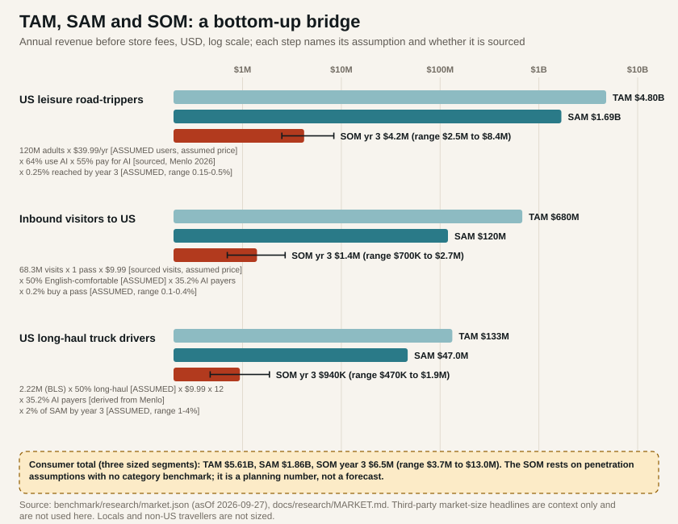
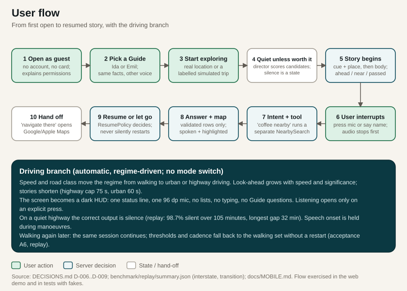
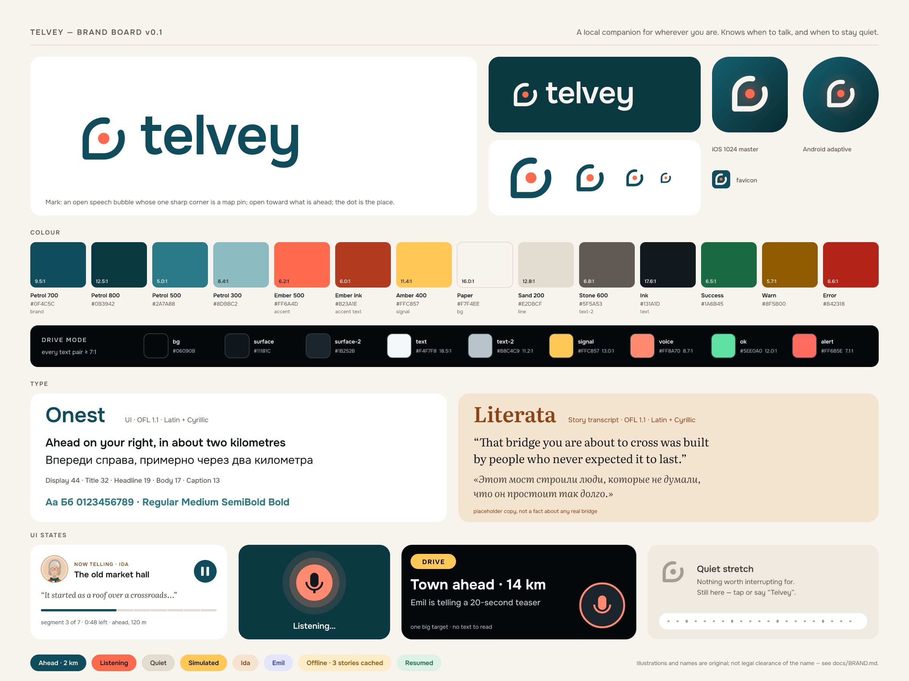
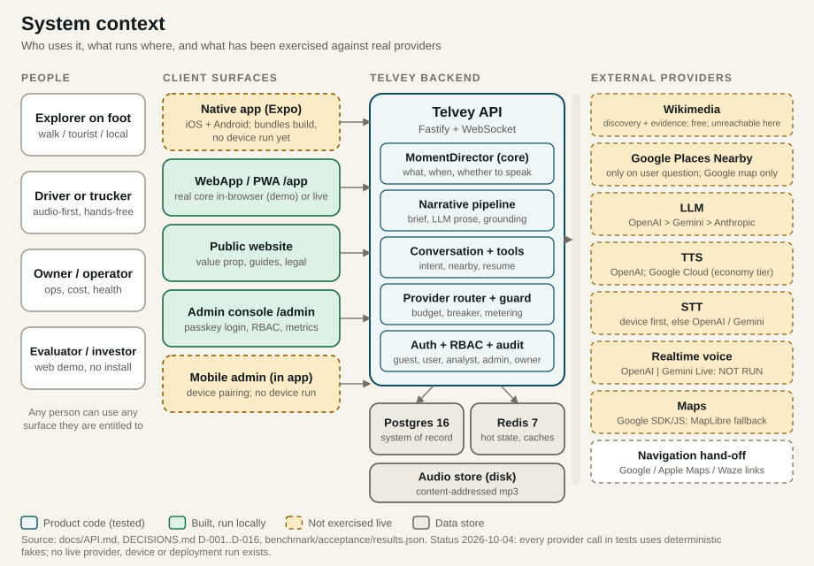
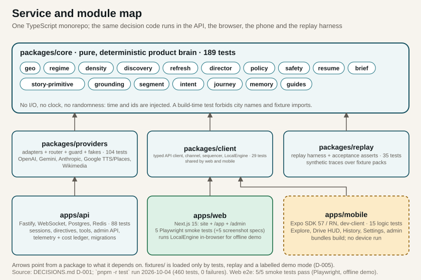
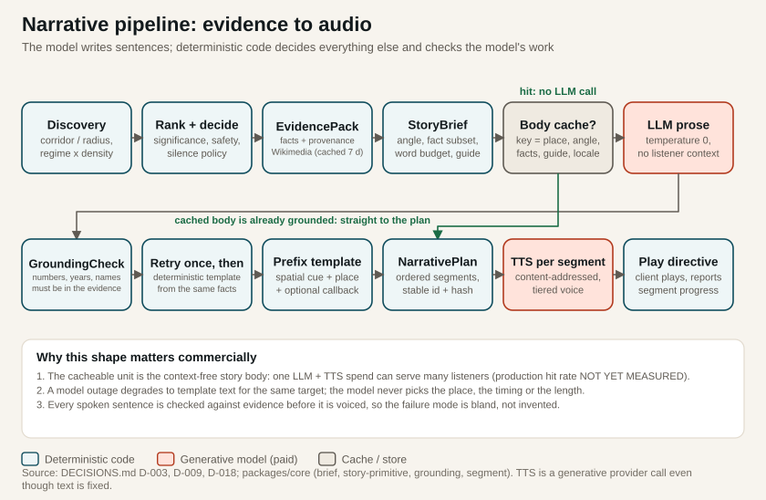
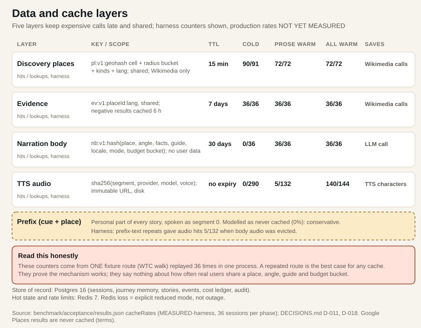
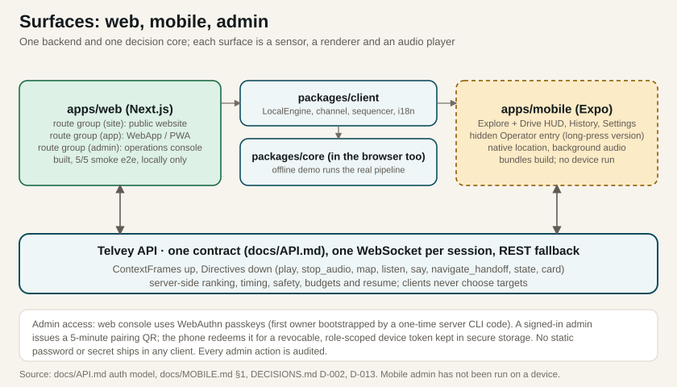
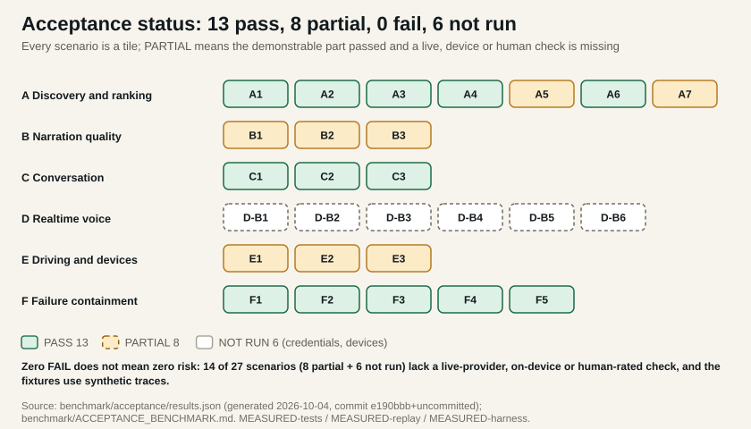
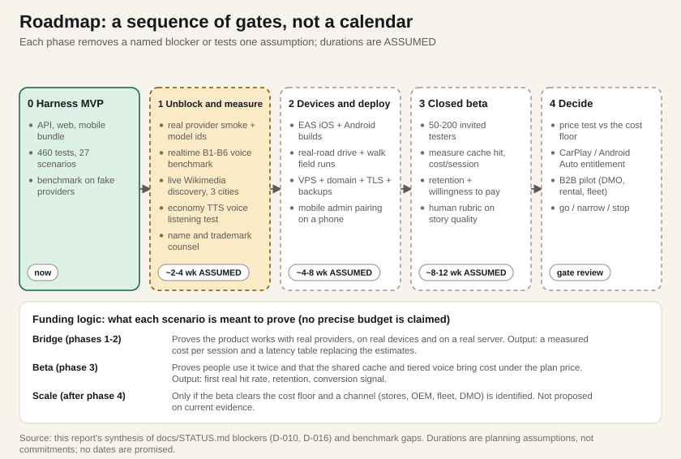

<!-- COVER and TOC are generated by scripts/report/build_report.py -->

# 1. Executive summary {#exec}

::: {.part}
Part I · The opportunity and the evidence in one page
:::

**What it is.** Telvey (a *working* brand, not legally cleared) is a voice-first companion for people who are walking or driving. It notices what is around or ahead, tells a short story about it that is checked against approved source facts (Wikipedia and Wikidata; no source is shown to the listener today), and stays silent when nothing is worth saying. A user can interrupt with a question ("Where can I get coffee nearby?"), see the answer on a map and rejoin the story where it stopped. Two original AI Guides, Ida and Emil, tell the same facts in different voices.

**Who it is for and where.** Travellers on foot, road-trippers, long-haul truck drivers (audio-first, hands-free) and curious locals. The product is global and location-first by owner decision. New York, Chicago, San Francisco and U.S. highways are *test geographies*, not launch markets.

**Why now, and why it is not obvious.** Language models and speech synthesis make narration of any place affordable. The platforms already answer place questions for free (Google Maps with Gemini, Gemini in Android Auto, Siri AI in iOS 27, ChatGPT voice). As of the research date, 2026-09-27, none was found narrating proactively. That gap is the product, and it is also the main risk, because a platform could close it with one setting.

**What was built (all in this repository, no users yet).** A TypeScript monorepo of about 28,000 lines of source plus about 5,000 lines of tests: a decision core, provider adapters with deterministic fakes, a Fastify API on Postgres and Redis, a Next.js website, WebApp and admin console, and an Expo mobile app that bundles but has never run on a device. **460 automated tests pass.** A 27-scenario acceptance benchmark reports **13 PASS, 8 PARTIAL, 0 FAIL, 6 NOT RUN** (PASS means demonstrated on synthetic fixtures with fake providers; two self-set cost budgets are missed, see section 15.3).

**Who built it, and who checked it.** The code, tests, fixtures, replay traces, benchmarks, cost model and this report were produced by AI coding agents for a single product owner. No independent human code, test or security review has been done. Tests and fixtures were written by the same agents as the code, so passing tests show internal consistency, not correctness in the world.

::: {.callout .warn}
**Evidence level.** The product has had zero real users, zero real-device runs and zero live-provider runs. Every performance number below is a [MEASURED-harness]{.tag} or [MEASURED-replay]{.tag} figure from real code running against fake providers with simulated latency; every dollar figure is an [ESTIMATED]{.tag} list-price model; every market figure is a bottom-up [ASSUMED]{.tag} model.
:::

| Headline number | Value | Label |
|:-----------------------------|:---------------------------|:----------------|
| Tests passing (core, providers, replay, client, API, mobile) | 460 of 460 | MEASURED-tests |
| Acceptance scenarios | 13 PASS, 8 PARTIAL, 0 FAIL, 6 NOT RUN | MEASURED-tests / -replay / -harness |
| Approved moment to first audio, p50 / p95 (target 2.5 s / 4.5 s) | 1,663 ms / 2,683 ms | MEASURED-harness, simulated providers |
| 30-minute walk, default mix, no shared cache | $0.306 | ESTIMATED |
| 30-minute highway drive, default / with tiered economy voice | $0.0167 / $0.0040 | ESTIMATED |
| Long-haul driver month (176 h, all sparse highway; $7.12 at 10% urban hours), tiered voice (economy on the highway), 0% / 50% shared cache | $3.61 / $2.96 | ESTIMATED; 50% is ASSUMED |
| Silence on the I-40 replay (105 min) | 98.7% (about 96% with model-length stories), longest gap 32 min | MEASURED-replay, synthetic trace; 96% is DERIVED |
| Consumer TAM / SAM / year-3 SOM (three sized segments) | $5.61B / $1.86B / $6.5M | ASSUMED, bottom-up |

**Commercial thesis.** Guest-first freemium, a $9.99 trip pass and a $39.99 annual plan ([HYPOTHESIS]{.tag}, anchored on Autio and Roadtrippers), then a driver plan once highway cost is proven. A paying Explorer user has a modelled 41% variable margin. The free tier as originally specified is not affordable.

**Largest unresolved risks, in order.**

1. **Platform risk.** Google, Apple or OpenAI can add proactive narration to an assistant that is already installed and free. Our own estimate puts Google's chance of closing the gap within 12 months at medium-high.
2. **Cost and cache.** Text-to-speech is 94% to 99% of variable cost in a plain session. The driver plan only works with an economy voice and a shared story cache; the production cache hit rate is [NOT YET MEASURED]{.tag}, and the economy voices are unauditioned.
3. **Nothing has met reality.** No live provider, device, road, network or human listener has touched the product. Wikimedia is unreachable from this sandbox, so live discovery is untested; realtime voice, iOS builds and any public deployment are blocked on credentials.
4. **Platform terms and brand.** Google Places terms limit caching and require a Google map; that display rule is documented but not yet enforced in code. The name Telvey is not legally cleared and the domains are unregistered.

**Decisive next experiment.** Supply the blocked credentials, run the realtime voice benchmark and a real-road field test, then put the product in 50 to 200 hands to measure cache hit rate, cost per session and whether anyone returns. Section 19 shows what each funding step is meant to prove.

# 2. Customer problem and target market {#problem}

::: {.callout .note}
**Honesty note.** No interviews, surveys or pilots have been run. The segments and jobs below are hypotheses assembled from public data and from competitor traction. They are the first things a beta must test.
:::

## 2.1 The problem

Most of what is interesting about a place is invisible from the sidewalk or the driver's seat. People who want to know more have three poor options today. They can stop and search, which breaks the moment. They can buy a scripted audio tour, which only works on its authored route. Or they can ask an assistant, which answers only if they already know what to ask. Nothing decides *for* them what is worth saying about the thing in front of them, and nothing knows when to stay quiet.

## 2.2 Segments and jobs to be done

| Segment | Job to be done | Context where value is highest | Why it matters commercially | Evidence quality |
|:-------------|:--------------------|:-------------------|:-------------------|:-------------|
| Traveller on foot | "Tell me what I am looking at, briefly, and let me ask follow-ups." | Unfamiliar dense city, first visit | Pays per trip: Autio 14-day $14.99, Narrativ €14.99 per 3 days | Competitor pricing (sourced) |
| Road-tripper | "Make the miles interesting without me touching the phone." | Interstates and scenic routes, hours at a time | Repeat buyers; Roadtrippers Premium ($59.99 a year) bundles Autio | Competitor pricing (sourced) |
| Long-haul truck driver | "Keep me company and awake, legally and safely." | Sparse highway, up to 11 driving hours a shift, silence is often correct | 2.22M heavy-truck jobs (BLS); willingness to pay unknown | Population sourced; WTP [ASSUMED]{.tag} |
| Local explorer | "Show me my own city again." | Weekend walks, commutes | High engagement, low willingness to pay | Not sized |
| Channel buyers (tourism boards, rental fleets, carriers, car makers) | "Offer a guide to our visitors, renters, drivers or owners." | White-label, in-car | Small today; long cycles; Autio inside Ford and Lincoln shows OEMs buy | Competitor evidence only |

## 2.3 Current alternatives and why they fall short

- **Scripted audio-tour apps** (Autio, VoiceMap, GuideAlong, Shaka Guide, SmartGuide, izi.TRAVEL, GPSmyCity). Strong willingness to pay ($15 to $40 per tour, $36 to $50 a year) and high ratings, but coverage ends where authoring ends.
- **Platform assistants** (Gemini in Maps and Android Auto, Siri AI, ChatGPT voice). Free and installed, good at answering, but the user has to ask. A hands-on review in February 2026 found Gemini in Maps strong on neighbourhood trivia and weak at route edits.
- **AI-native lookalikes** (RoadWhisper, Roadguide, Nextour, Narrativ, Road Trip Voice Tour Guide AI). Dynamic narration of any place, but negligible public traction (Google Play counts of 100+ to 1K+ where public; several newer entrants publish no counts) and, as far as public descriptions show, interval or radius triggers with no stated grounding check or silence policy.
- **Radio, podcasts and silence.** In-car listening in the past month: AM/FM 73%, online audio 48%, podcasts 37% (Infinite Dial 2026, retrieved 2026-09-27). The product competes for that time.

## 2.4 Where the product should win

The strongest cases are those where *deciding when to speak* matters: a driver on a sparse highway (where silence is the correct behaviour: about 96% of the time with model-length stories in our replay (98.7% with the shorter template speech), on a sparse fixture where few candidates exist), a pedestrian in a dense district where dozens of places compete for attention, and a returning user who should not hear the same story twice. These are design claims backed by replay tests on synthetic traces. Whether people value them is unmeasured.

# 3. Market potential and competitive landscape {#market}

## 3.1 Competitors and traction

| Competitor | Type | How it finds things | Price (sourced) | Public traction (sourced, point in time) |
|:--------------|:-----------|:-----------------|:---------------|:--------------------------|
| Google Maps with Gemini | Platform | User asks | Free | Ask Maps launched US and India 2026-03-12 with CarPlay and Android Auto; Gemini in walking and cycling navigation worldwide Feb 2026 |
| Gemini in Android Auto | Platform | User asks | Free | Global rollout, 45 languages |
| Apple Siri AI (iOS 27), Maps | Platform | User asks | Free | iOS 27 released Sept 2026; no Maps narration feature found |
| ChatGPT voice | Platform | User asks | Freemium | Location sharing Mar 2026; CarPlay voice, audio-only |
| Autio | Direct, scripted | GPS-triggered library of 20,000+ stories | $14.99 (14 days) to $49.99 (1 year) | iOS 4.8 stars / 4.3K ratings; Play 3.5 stars, 10K+; 230K registered users (2023); in Ford and Lincoln vehicles |
| GuideAlong | Direct, scripted | 100+ driving tours | $14.99 to $39.99 per tour | iOS 4.9 stars / 16K ratings |
| VoiceMap | Direct, scripted | 2,100+ tours | $3.99 to $19.99 per tour | iOS 4.8 stars / 3.4K; Play 100K+ |
| Shaka Guide, SmartGuide, izi.TRAVEL | Direct, scripted | Authored tours | Per tour / B2B €98 to €780 a month / membership, price not published | Play 100K+ / 1M+ / 1M+ (izi.TRAVEL 2.3 stars) |
| Le Walk | Direct, scripted | Cinematic walks | n/a | $4.1M seed; 110K beta downloads (2025-09-19) |
| AI-native narrators (RoadWhisper, Roadguide, Nextour, Narrativ and others) | Direct, dynamic | Radius or interval triggers | Free to $2.99 a month; credits | Play counts of 100+ to 1K+ where public |
| Waytale | Direct: GPS-triggered playback, AI narrators (live generation vs pre-authored not verified) | Passes 3 days $3.99, 7 days $5.99, 14 days $9.99 | First released 2025-09-03; no public ratings yet | App Store listing, checked 2026-10-04: "Companion Mode" plays stories automatically as you explore, three AI narrators; no Q&A or CarPlay listed |

: Selected competitors. Full list of 19 entries (one groups five AI-native apps) in `benchmark/research/competitors.json`, retrieved 2026-09-27. {.tablecap}

{#fig:matrix}

Three observations follow from {{fig:matrix}}. First, proactive narration exists in many scripted apps and, per Waytale's listing, in at least one AI-narrated app that has been live for about thirteen months, so "proactive" and "AI voices" are not differentiators; the differences are *any place*, *trajectory-ahead* reasoning, an explicit *silence policy* and *journey memory*, and each of those is a design claim not yet validated by users. Second, the as-built row is mostly "partial" because nothing has been proven live, on a device or with real providers. Third, the matrix understates how crowded the AI-native end is: search results on 2026-10-04 show at least Waytale (listing read), Guidel (tap-to-listen and image-scan guide, no ratings yet), Tourly Audio, CityTour AI, Guideline, Narriva and Votura alongside the lookalikes already tracked (the others by title only). Absence of a feature in the matrix means "not found in public sources", not "absent".

## 3.2 The big-platform risk

| Actor | Shipped (sourced, 2026-09-27) | Gap left | Chance it closes the gap within 12 months (our judgment, [ASSUMED]{.tag}) |
|:-------|:------------------------------------|:----------------------|:----------------|
| Google | Gemini in Maps for driving, walking and cycling; Ask Maps; Gemini Live in Android Auto; landmark-based guidance | Proactive, paced story narration; silence policy; personas; cross-session memory | Medium-high |
| Apple | Siri AI (Gemini-based) in iOS 27; Visual Intelligence; controls CarPlay entitlements | Location-proactive narration | Low-medium |
| OpenAI | Location sharing; ChatGPT voice in CarPlay | Background location; proactive triggers; map grounding | Medium |
| Car makers | Mercedes MBUX with Google; Ford and Lincoln with Autio | Cross-brand, phone-based product | Channels as much as threats |

The honest reading: Q&A about a place is table stakes and free, so it cannot be the product. The research did not find a proactive narration feature in Google's 2025 and 2026 announcements, but absence of evidence in a web search is weak evidence. If a platform adds one toggle, the core proposition is commoditised and only verticals (long-haul drivers, destination partners, fleets) and execution quality remain.

## 3.3 Market size: a bottom-up bridge

Third-party headlines are context, not inputs. One paid report puts self-guided audio tours at $2.86B in 2025 growing to $5.71B by 2034 (Verified Market Reports; methodology not visible, definitions unclear). A venture survey puts consumer AI spend at $40B in 2026 (Menlo Ventures; its own headline notes that user growth barely moved). Neither is used below.

The model multiplies a population by a usage share by a price, and labels every input as sourced or assumed.

{#fig:tam}

| Segment | TAM | SAM | SOM, year 3 (range) | Weakest assumption |
|:------------------|:----------|:--------|:---------------------|:-------------------------|
| US leisure road-trippers | $4.80B (120M adults x $39.99) | $1.69B (x 64% use AI x 55% pay) | $4.2M ($2.5M to $8.4M) at 0.25% | 120M unique adults: no sourced count; must exceed 39.1M on one holiday weekend |
| Inbound visitors to the US | $680M (68.3M visits x $9.99) | $120M | $1.4M ($0.7M to $2.7M) at 0.2% | 50% English-comfortable; 0.2% buy |
| US long-haul truck drivers | $133M (2.22M x 50% x $9.99 x 12) | $47M | $0.94M ($0.47M to $1.87M) at 2% | 50% long-haul share is a placeholder |
| **Consumer total** | **$5.61B** | **$1.86B** | **$6.5M ($3.7M to $13.0M)** | Penetration has no category benchmark |

: Figures are annual revenue before store fees (net is about 85% only if Apple's Small Business Program applies, which holds up to $1M of proceeds; above that, standard store rates apply). Locals and non-US travellers are not sized because no defensible usage or willingness-to-pay input exists. {.tablecap}

**Read the year-3 figure as an upper bound, not a forecast.** The SOM is 0.25% of the serviceable market, about 106,000 paying road-trip subscribers, roughly 46% of the registered (not paying) base Autio reports after about five years; it models no ramp, acquisition cost or churn, and the research cites about 72% first-year annual cancellation for subscription apps. The inbound-visitor segment is 0.2% of all visits (about 1.1% of its SAM) while the others are a share of SAM. The SAM filter is a US-adult proxy (AI-payer share) applied to non-US visitors and drivers, the AAA traveller count includes children, and the 68.3 million inbound visits include Canada and Mexico and count visits, not persons. A downside case at 0.05% of SAM would be about one fifth of the SOM shown.

Business-to-business segments are small on a bottom-up basis: tourism boards $7.9M (658 member organisations x $12,000), car rental $13.9M, fleet driver wellbeing $80M, vehicle makers $48.6M, about $150M together and mostly a distribution channel. For scale: Autio reached about 230,000 *registered* users (not payers) roughly five years after founding. The SOM above should be read as "what 0.25% of a plausible audience would pay", not a forecast.

# 4. Differentiation and defensibility {#moat}

| Claimed advantage | Exists today? | What the evidence is | What is missing |
|:-----------------|:-------------|:--------------------------|:------------------------|
| Decides when to speak, including long silence | Built (policy; silence on a sparse fixture reflects few candidates as much as judgement, and no naive-trigger baseline has been run) | Replay on synthetic traces: 98.7% silent on I-40 (105 min) and 84% to 91% on city walks (template-length speech; see section 10.3), zero stories behind the user or passed mid-story ([MEASURED-replay]{.tag}) | Walking silence is overstated, see section 10.3; no user has judged the timing |
| Looks ahead along the trajectory | Built | A5 replay: 5 stories, 0 behind, look-ahead scales with speed and significance | Real-road field run; live discovery |
| Facts are grounded | Built, tested with fake prose | GroundingCheck rejects unsupported numbers, years and names; 0 grounding failures across all replays | No real LLM has been checked (B-series PARTIAL) |
| Exact interruption and resume | Built | Coffee flow passes 36 of 36 harness sessions (one scripted scenario repeated 36 times with seeded delays, not 36 independent cases); resume at the start of the interrupted segment with a bridge phrase | Device audio behaviour not tested |
| Journey memory, no retelling | Built | No re-told targets in any replay; 30-day cross-session retell window (D-023) | Real usage patterns unknown |
| Two Guides with one set of facts | Built at brief level | Same lead fact in 31 of 31 evidence packs; verbosity 1.15 against 0.80 | Live LLM prose and human rating not run (B2) |
| Provider independence | Built | Interfaces, ordered fallback chains, fakes; every test swaps providers | No real provider has been exercised or swapped |
| Cost architecture (shared story cache, tiered voice) | Built | 100% body-cache hits in a one-route harness repeat | Production hit rate not measured |

**Which moats exist today.** Honestly, none beyond execution detail. The code is copyable, the lookalike apps show how easily the concept is copied, and switching costs for users are low (journey memory is small). The defensibility case is therefore a set of *future hypotheses*:

- **Feedback loop.** Skips, "not that one" and ratings tell the system which places and angles are worth interrupting for. It needs users to exist.
- **Shared-content cost advantage.** A shared story body and shared audio let marginal cost fall as more people hear the same place. It is only a moat if real hit rates are high.
- **Distribution.** CarPlay, Android Auto, vehicle makers and tourism partners are gated by entitlements and relationships, not code.
- **Editorial quality.** Timing, grounding and silence are craft. Competitors can copy them, but only by doing the same unglamorous work.

# 5. Product and user experience {#product}

::: {.part}
Part II · The product
:::

## 5.1 What a session looks like

A visitor opens the WebApp or app. There is no account and no card: a guest token is issued and a Start card offers "Use my location" or one of four simulated trips. They pick a Guide (Ida by default), press start, and put the phone away.

From then on the product runs a loop. It reads the live context (position, heading, speed, whether the person is walking, driving or standing still, how dense the surroundings are) and asks what is worth saying about something nearby or ahead. Most of the time the answer is *nothing*, and the app says so quietly ("Quiet stretch"). When a target clears the bar, the Guide tells a short story in segments, with a spoken cue about where the thing is ("straight ahead, about 800 feet"). The listener can interrupt at any point by pressing the mic: the story stops, the question is answered from verified data, the map updates, and the story resumes where it was cut off. When the system detects driving, the screen collapses to a single status line and one large voice button.

{#fig:flow}

## 5.2 Screen walkthrough

The twelve phone-width captures below were taken from the production build of the WebApp, running locally in offline demo mode, on 2026-10-04. Each caption states what was actually on screen; none is a mockup.

::: {.callout .warn}
**How to read these screenshots.** Every capture is *offline demo mode*: the real decision code runs in the browser over fixture places and evidence. The location is simulated (an amber banner says so), the story text is template prose with no language model, there is no speech voice, and the map is a schematic overlay because tile servers are unreachable from the capture sandbox. "Cafe #NNN (synthetic)" markers are generated, not real businesses. Nothing here shows voice quality, real maps or on-device behaviour. The status label for this whole section is [MEASURED-e2e]{.tag} for behaviour and [NOT RUN]{.tag} for everything on a device.
:::

<figure><figcaption><b>1 Guest entry.</b> First run: no account, no card. Start card with four simulated trips and "Use my location"; chip reads "Offline demo mode". Captured before any trip starts.</figcaption></figure>
<figure><figcaption><b>2 Guide selection.</b> Ida selected, Emil available, talkativeness control at its default. Same facts, different voice and angle.</figcaption></figure>
<figure><figcaption><b>3 Explore, idle.</b> After a skip, the director enforces a cadence gap: "Quiet stretch", regime "Walking, dense". Silence is a designed state, not an error.</figcaption></figure>
<figure><figcaption><b>4 Approaching a target.</b> First story has just started on the Lower Manhattan replay: spatial cue "straight ahead, about 800 feet", target ringed on the schematic map, segment 1 of 3.</figcaption></figure>
<figure><figcaption><b>5 Active story.</b> Segment 2 of 3 with per-segment progress ticks (these are the resume points). Pause, Skip and "Not that one" are the controls.</figcaption></figure>
<figure><figcaption><b>6 Interruption.</b> Mic pressed mid-story: narration stopped, listening sheet open. Headless Chromium has no speech recogniser, so "Type instead" is offered; a typed question is captured in the packet.</figcaption></figure>
<figure><figcaption><b>7 Nearby result on the map.</b> "The closest is Corner coffee bar, about 0.2 miles away. I've put 5 options on the map." Story card shows "Paused while you talk". Places are synthetic.</figcaption></figure>
<figure><figcaption><b>8 Resumed story.</b> After the answer, the resume policy restarts the interrupted segment with a bridge ("Where was I? Ah yes, ...") instead of restarting the story.</figcaption></figure>
<figure><figcaption><b>9 Drive-safe state.</b> The highway regime on the synthetic I-40 replay switches on the DRIVE HUD by itself: dark palette, one status line, one large mic, no lists, no text input.</figcaption></figure>
<figure><figcaption><b>10 History.</b> Places told in this session, kept in this browser only and labelled "Simulated".</figcaption></figure>
<figure><figcaption><b>11 Settings.</b> Guide, talkativeness, language (English or Russian), units, appearance, voice, connection mode (Auto, Live, Offline demo) and "Delete my data".</figcaption></figure>
<figure><figcaption><b>12 Degraded delivery.</b> With no voice available the answer arrives as text only and the card says so. The story continues. A second capture (packet) shows the app refusing to pretend it is live when no API is configured.</figcaption></figure>

## 5.3 Desktop and operator surfaces

{#fig:webapp}

{#fig:explain}

{#fig:site}

{#fig:admin}

**The mobile admin surface was not captured.** No device, emulator, Android SDK, macOS host or build credential exists in the environment, and the native app has never run. We chose not to render its screens through a web shim because that would be mistaken for a device capture. The screens exist in code (health, today's sessions and stories funnel, latency, cost, recent errors, device pairing by QR or code) and are inventoried in `docs/MOBILE.md`; they are listed as not evidenced in section 17.

**Demo recording.** A 74-second screen recording of the offline demo (walk, mic press, typed coffee question, answer, resume, switch to the highway trip and the drive HUD) is in the comparison packet as `telvey-web-demo.mp4`. It carries the same limits as the screenshots.

## 5.4 What the product deliberately does not do

- It does not ask the driver anything. In driving regimes there are no tap-to-choose prompts, no Guide questions and no text input, and listening opens only on an explicit press.
- It does not tell stories about places it has too little evidence for. Thin evidence yields at most one short orientation line.
- It does not retell a place within 30 days of telling it to the same listener.
- It does not navigate. Directions are handed off to the user's navigation app.

# 6. Brand and naming {#brand}

::: {.callout .warn}
**Working name only.** *Telvey* is a working brand. The screening below is a preliminary signal check made from live RDAP and DNS lookups and web, App Store and Google Play searches on 2026-09-27. It is **not** a trademark clearance, a freedom-to-operate opinion or legal advice, and no official trademark register was queried. The domains are **unregistered** as far as the last check showed; availability can change at any moment, and it was not re-verified on 2026-10-04 because the lookup tool was denied access in this session. A professional clearance search (Nice classes 9, 38, 39, 41 and 42; US, EU, UK and RU) is needed before any public use.
:::

## 6.1 Candidates and the screen

About 900 names were generated and pre-screened by DNS; twelve were carried into a longer list and seven into full domain checks. The brief: short, pronounceable in English and Russian, verb-able, iconable, not tied to a city or to "tour", and ideally a free .com or .ai.

| Name | Idea | Domain result (2026-09-27 UTC) | Collision notes | Verdict |
|:-----------|:------------------|:-----------------------|:-----------------------------|:----------|
| **Telvey** | *tell* + *convey* / *way* | .com, .ai, .app, .io, .dev, gettelvey.com free (RDAP 404); .co inconclusive | No product named Telvey found. Neighbours in other sectors: TelVue (broadcast), Telviva (telecom), Telva (magazine) | **Selected (working)**; risk low to medium ("Tel-" is crowded in telecom, class 38) |
| Loreyon | *lore* + *yonder* | .com, .ai, .app free | Historic surname only; "LORE" marks exist | Cleanest alternative |
| Wendalong | *wend* + *along* | .com, .ai, .app free | Word-game apps | Long (9 letters) |
| Sayonder | *say* + *yonder* | .com, .ai, .app free | Sounds like "sayonara" | Weak brand |
| Tellaround | *tell* + *around* | .com, .ai, .app free | Close to "Showaround" (local-guide app) | Medium risk |
| Kolero | coined | .com registered 2025-08-11 | Polish word, film, esports handle | Rejected |
| Hushway | *hush* + *way* | .com and .app registered | n/a | Rejected |
| Waytale | *way* + *tale* | .com and .app registered | **Direct collision:** "Waytale: AI Audio City Guide" is live on the App Store | Rejected |

: Shortlist, abridged. Full longlist of twelve and every RDAP endpoint with its time window are in `docs/BRAND.md` and `benchmark/brand/domain_checks.json`. {.tablecap}

**Why Telvey.** It is not a dictionary word (room to become ownable), does not say "tour", "city" or "AI", has two clear syllables with the same pronunciation in English and Russian («Телвей»), and works as a verb ("just Telvey it"). A wake word "Hey Telvey" is a possibility only; a false-trigger evaluation has not been run and the app does not use a wake word. **Owner actions:** register telvey.com, telvey.ai and telvey.app, reserve handles, commission the clearance search. The Waytale result is also a reminder that the AI audio-guide space is moving: an AI audio city guide with selectable narrators is already live on the App Store.

## 6.2 Identity system

{#fig:brand}

The mark is an open speech bubble whose sharp lower-left corner doubles as a map-pin point; the opening faces upper right ("ahead") and a single ember dot in the centre is the place being talked about. The idea is "a local who knows when to talk": calm, warm, precise. Petrol (deep blue-green) is the ground, ember is reserved for the place and for listening, and silence is presented as a feature.

| Role | Value | Note |
|:---------------|:------------------------|:-----------------------------------------|
| Primary | Petrol 700 `#0F4C5C` | 8.66:1 on paper (AAA) |
| Accent | Ember 500 `#FF6A4D`; ember-ink `#B23A1E` for text | Ember is decorative only on light backgrounds (2.58:1); accent text uses ember-ink (5.44:1) |
| Drive theme | `#06090B` ground, text `#F4F7F8` | Every text pair at least 7:1 (AAA); nothing smaller than 28 px |
| Typography | Onest (UI, Latin and Cyrillic), Literata (story text), JetBrains Mono (admin numerals) | All SIL Open Font License |
| Contrast | Computed with the WCAG 2.2 relative-luminance formula | Table in `docs/BRAND.md` |

: Palette and type, summary. Assets: mark, wordmark, horizontal lockups, iOS and Android adaptive icons, favicon and tokens are in `assets/brand/` and in the packet. {.tablecap}

# 7. Original AI Guides {#guides}

Two original Guides tell the same facts. They differ only in angle, length, humour, framing and voice. Neither is derived from an existing character, brand or person; portraits and scenes are hand-authored vector art with no real skyline, landmark or sign text.

| | **Ida** | **Emil** |
|:-----------|:---------------------------------|:---------------------------------|
| Concept | The unhurried storyteller who has time for every street | The sharp-eyed observer who gets to the point |
| Angle | People, origins, everyday life, links to earlier places | Hidden details, numbers, architecture, turning points |
| Verbosity (x regime budget) | 1.15 | 0.80 |
| Humour | 0.30, gentle | 0.65, dry, never snide |
| Opening and sign-off | Sensory scene, then the person; soft reflection | Hook detail first; crisp one-liner, then silence |
| Voice direction | Mature, warm, low-mid, rate 0.95 | Clear, bright, mid, rate 1.05 |
| Voice candidates (**pending the D-010 listening test**) | OpenAI `sage` (alt `coral`); Google Gemini `Gacrux` (alt `Sulafat`) | OpenAI `ash` (alt `cedar`); Google Gemini `Iapetus` (alt `Sadachbia`) |

: Guide profiles. Source: `packages/core/src/guides/ida.json`, `emil.json`; `docs/BRAND.md` section 3. {.tablecap}

<figure><figcaption>Ida, portrait</figcaption></figure>
<figure><figcaption>Ida, city-context scene (generic low-rise street, golden hour)</figcaption></figure>
<figure class="av"><figcaption>Ida, avatar crop</figcaption></figure>
<figure><figcaption>Emil, portrait</figcaption></figure>
<figure><figcaption>Emil, city-context scene (generic highway at dusk, unnamed town ahead)</figcaption></figure>
<figure class="av"><figcaption>Emil, avatar crop</figcaption></figure>

**How factual consistency is preserved.** The Guide never chooses facts. A deterministic step builds a *StoryBrief* from the evidence pack (the approved facts, the angle, the length budget). Both Guides receive the identical facts at the same budget; the persona changes only how they are phrased. A language model writes the prose, and a *grounding check* then rejects any number, year or proper noun that is not in the approved evidence. If it fails, there is one constrained retry and then a deterministic template built from the same facts.

| Check | Result | Label |
|:----------------------------------------|:---------------------|:-------------|
| Same lead fact for both Guides, across evidence packs | 31 of 31 | MEASURED-replay |
| Identical brief facts at the same budget | 100% of packs | MEASURED-replay |
| Grounding failures across all replay stories | 0 | MEASURED-replay (template prose) |
| Persona parameters differ (verbosity 1.15 vs 0.80, rate 0.95 vs 1.05, angle order) | Yes | MEASURED-tests |
| Pacing, structure and tone of live prose; human 1-to-5 rubric (naturalness, pronunciation, persona distinctness, factual preservation; English and Russian) | **Not run** | NOT RUN: needs a live model and raters |

The honest limit: the deterministic fallback template is persona-neutral by design, so every Guide-difference claim at the *prose* level rests on a language model that has not yet been run. Acceptance B2 is therefore PARTIAL. The voice identifiers above are candidates that were seen in the providers' public documentation on 2026-09-27; Russian quality and the fit of voice to persona must be judged by ear.

# 8. Architecture {#architecture}

::: {.part}
Part III · How it is built and what was measured
:::

The system has one organising idea: **a language model may write sentences, but deterministic code decides everything else and checks the model's work.** Which place to talk about, when to speak, how long, whether it is safe, when to stay silent and how to resume are all computed by a pure, tested library. The model receives an already-decided brief and returns prose, which is then verified before anyone hears it. This keeps the behaviour that matters (timing, relevance, safety) testable without paying for a model, and it makes a model outage degrade to bland text instead of invented text.

{#fig:context}

{#fig:modules}

{#fig:pipeline}

{#fig:state}

{#fig:routing}

{#fig:cache}

{#fig:surfaces}

## 8.1 Major choices and what they cost

| Choice | Why | Trade-off accepted |
|:-----------------------|:-------------------------------|:------------------------------------|
| **Server owns product authority** (D-002). Clients are sensors, renderers and players | One policy for every surface; clients cannot fork behaviour | Offline behaviour needs a bounded prefetch and a local copy of the engine (built for demo mode) |
| **LLM only writes or interprets** (D-003) with a deterministic grounding check and template floor | Failure mode is bland, not invented; target choice cannot be corrupted by a generator | Prose quality ceiling is the template floor when the model fails; live grounding pass rate is unmeasured |
| **Location-first, no city coupling** (D-004, D-005) | The owner's global requirement; a build-time test forbids city names and fixture imports in production code | Real candidate density is untested because live discovery was unreachable |
| **Regimes and trajectory corridors** (D-006, D-007) | Highway reasoning needs "what is ahead", not "what is near"; silence is a first-class outcome | Thresholds are hand-set and only checked on synthetic traces |
| **Exact resume** (D-009) | Interrupting must not lose the story | Resume restarts the segment, not the sentence |
| **Hybrid voice, not always-on realtime** (D-010, provisional) | Cost is bounded to spoken minutes; no open microphone while driving | Turn-taking is likely slower than realtime; unmeasured |
| **Shared context-free story body + uncached personal prefix** (D-018) | One model call and one voice render can serve many listeners; no personal data in the shared cache | Repeat listeners hear one canonical telling; a second short voice call per story; seam audible if voices differ |
| **Tiered voice** (D-019) | Highway narration on a roughly 4x cheaper voice | Economy voices are unauditioned candidates; city stays on the standard voice |
| **Postgres plus Redis, single VPS** (D-011, D-015) | Cheap, simple, replaceable | Sticky WebSockets, local audio and process-local budget windows block multi-instance; see section 16 |
| **Privacy-minimal telemetry** (D-012) | Coarse geohash only, no raw traces unless the user opts in | Limits some product analytics |

# 9. Technology and provider decisions {#providers}

::: {.callout .warn}
**No provider decision rests on a live measurement.** No provider key was supplied, so every row below is a design or list-price judgement. The decision procedure for replacing it with evidence is in section 11.
:::

| Layer | Choice (default) | Alternatives considered | Reason (and its evidence level) | Lock-in risk | Fallback or migration |
|:---------|:--------------------|:-------------------|:---------------------------|:--------|:------------------|
| Language | TypeScript strict, Node 22, pnpm monorepo | Separate server and mobile stacks | One type system across every boundary; replay harness runs the production code. [MEASURED-tests]{.tag} | Low | n/a |
| Story and intent model | `gpt-6-luna`; chain OpenAI, Gemini, Anthropic | Gemini Flash-Lite, Claude Haiku or Sonnet | Lowest list price; the model is under 2% of session cost, so choose on grounding rate and latency, **both unmeasured**. [ESTIMATED]{.tag} | Low: interface plus three adapters | Template story floor; kill switch |
| Voice (TTS) | `gpt-4o-mini-tts` standard; Google Cloud WaveNet economy tier for highway (in this report "economy tier" always means Google WaveNet) | tts-1, Gemini TTS, ElevenLabs, Deepgram, Cartesia | The single biggest cost line; WaveNet is about 4x cheaper per character. Voice quality **unauditioned**. [ESTIMATED]{.tag} | Medium: per-persona voice ids | Standard chain, then device voice and text |
| Speech input | Device recognition first, else `gpt-4o-mini-transcribe` | Gemini transcribe, Deepgram, ElevenLabs Scribe | Free on device; under $0.001 per question otherwise. [ESTIMATED]{.tag} | Low | Server STT, then typed text |
| Realtime voice | None selected; hybrid loop runs | OpenAI Realtime, Gemini Live, GPT-Live-1 | Cost and risk reasons only (section 11). [NOT RUN]{.tag} | Medium | Hybrid loop |
| Discovery and evidence | Wikimedia (Wikipedia and Wikidata): free, cacheable, poolable | Google Places, OSM Overpass | Free, shareable across users, strongest on significance and history; rate-limited. **Unreachable from the build sandbox, so live discovery is untested.** | Low | Self-hosted Wikidata and OSM extract; fixtures for demo only |
| Nearby search (tool) | Google Places Nearby Search Pro, only on a user question | Wikimedia, Overpass, Mapbox Search | Needs business data (open now, category). $0.032 per call. [ESTIMATED]{.tag} | Medium | Spoken "limited" phrase; alternative source |
| Map | MapLibre with OpenStreetMap on web by default; Google Maps JS when a key is set; Google Maps SDK on Android; Apple Maps on iOS without a Google key | Mapbox, Google everywhere | Native Maps SDK is free; see the terms conflict below | Medium | Schematic overlay when tiles fail |
| Web and mobile | Next.js 15 (site, app, admin in one app); Expo SDK 57 with React Native 0.86 | Separate sites; Flutter | One design system, one deployment; native modules need a dev client. Bundles compile; no native build ever ran. [MEASURED-tests]{.tag} | Low | n/a |
| Data stores | Postgres 16 and Redis 7 | Managed services, SQLite | Standard and cheap; Redis loss is an explicit reduced mode. [MEASURED-tests]{.tag} | Low | Managed services when scaling |
| Admin auth | WebAuthn passkeys; device-pairing for the phone | Passwords, email OTP | No static secret exists anywhere to leak. [MEASURED-tests]{.tag} | Low | Invite codes |
| Hosting | One VPS, Docker Compose, Caddy TLS, GitHub Actions | Managed PaaS | Cheapest MVP path; **never built on a real host** | Low | Any container host |

**Google Places terms shape the architecture, and one rule is not yet enforced.** Google's service-specific terms (retrieved 2026-09-27) allow only latitude and longitude from Places to be cached, for at most 30 consecutive days; place identifiers are exempt; and Places content must not be shown on a non-Google map. The code honours the first two: Places results are never put in the shared discovery cache, discovery uses Wikimedia, and Places is called only for an explicit question. The third is documented but **not enforced in code**: the web map defaults to OpenStreetMap, and on iOS the app uses Apple Maps unless a Google Maps SDK key is supplied, so a live Places result could be drawn on a non-Google map. This must be closed (a Google map wherever Places content appears, or a different nearby-search source) before any live Places traffic. Legal should also review whether generated narration derived from Places fields may be cached.

**Further terms and licences, checked 2026-10-04.** (1) Google's terms also contain a Places UI Kit exception that allows a non-Google map, and it prevails over the non-Google-map rule; whether text-to-speech audio derived from Places fields counts as Google Maps content is an open legal question. (2) Wikipedia text is licensed CC BY-SA 4.0 (Wikidata is CC0). Narration adapted from it needs attribution and may carry ShareAlike obligations that reach cached story text and shared audio; no attribution is shown to the listener today and legal review is required. (3) The default web map uses OpenStreetMap raster tiles; the public tile servers are not for production traffic, so a production tile source and attribution are needed. (4) Google's current pricing page lists Standard and WaveNet voices at $4 per million characters but under "Legacy TTS models"; the current-generation Chirp 3 HD voice is $30 per million, about 1.8 times the standard voice used here. If a current-generation voice is required, the economy tier's cost advantage largely disappears, so the driver plan's viability rests on a legacy voice family.

**Model-name conflict.** The OpenAI pricing page on openai.com and the developer documentation listed different flagship model names on 2026-09-27 ("GPT-5.6 Sol/Terra/Luna" versus "GPT-6 Astra/Sol/Luna"). The developer docs and the individual model pages agreed with each other, so the model identifiers and prices used here come from them. The identifiers must be confirmed with the provider's model-list call when keys arrive; the provider benchmark script does exactly that and has so far run with no keys.

# 10. Performance results {#performance}

## 10.1 What was measured, and on what

All latency figures below are **MEASURED-harness**: the real API (Fastify, Postgres 16, Redis 7, WebSocket) runs in-process on loopback in a sandbox with two CPUs, and every external provider is a deterministic fake wrapped in a seeded log-normal delay chosen to resemble that class of API. The delay profile is an assumption, not a measurement of any provider: story LLM 1,100 ms median and 2,600 ms 95th percentile; follow-up LLM 700 and 1,600 ms; text-to-speech 250 ms plus 2.5 ms per character; speech-to-text 450 and 1,100 ms; nearby search 250 and 650 ms. The harness therefore proves the orchestration (what runs in parallel, that stale turns are dropped, that nothing waits needlessly). It does not prove real provider speed, tail behaviour or network cost.

Three further limits matter. Fake prose is shorter than real model prose, so the harness voice terms are optimistic. Loopback hides network time (add roughly two round trips; an ASSUMED 40 to 120 ms each on LTE, not measured). And each figure is 36 seeded sessions after one excluded warm-up, so a margin of a few percent against a target is within noise.

## 10.2 Latency against targets

The template contains no numeric targets, so these targets were proposed by the build agents and need owner sign-off.

| Interaction | Target p50 / p95 | Result p50 / p95 | Verdict |
|:------------------------------------|:--------------|:--------------------|:-------------------------------|
| Approved moment to first audio, nothing cached | 2.5 s / 4.5 s | **1,663 / 2,683 ms** | Met in simulation |
| Cached story to first audio, body cached, audio evicted | 0.5 s / 1.0 s | 448 / 883 ms | Met in simulation (conservative case) |
| Cached story to first audio, fully warm | 0.5 s / 1.0 s | 6 / 28 ms | Met on loopback; a cache read only |
| Speech end to answer audio, "coffee nearby" | 2.0 s / 3.5 s | 1,250 / 2,328 ms | Met in simulation |
| Speech end to answer audio, contextual follow-up | 2.0 s / 3.5 s | **1,950 / 3,380 ms** | Met by a 3% margin at the 95th percentile; was 2,840 / 4,915 ms (missed) before streaming |
| Speech end to nearby results on the map | 1.5 s / 2.5 s | 701 / 1,545 ms | Met in simulation |
| Interrupt to stop signal (server round trip) | 150 ms / 300 ms | 1.0 / 1.5 ms | Met on loopback; **press-to-silence on a device not measured** |
| Context frame ingest | n/a | 0.1 / 0.2 ms | Local compute is negligible |
| Native app launch to usable Explore | 1.5 s / 3.0 s | none | **NOT RUN**: no build exists |
| WebApp first usable state | 1.5 s / 3.0 s | none | **NOT YET MEASURED**: only a functional end-to-end pass exists |

: All rows MEASURED-harness with simulated providers unless the result says none. Source: `benchmark/acceptance/latency.json`, n = 36 per metric. {.tablecap}

The follow-up row is the most fragile number in the report. It depends on an assumption that the model's first word arrives after 45% of its simulated total latency and that voice rendering starts per sentence. With real providers it may move either way. Treat it as "inside target in simulation by a thin margin", not as a guarantee.

{#fig:latency}

**Slowest stages.** Provider time dominates everything: the story language model (about 1.1 s simulated) and voice rendering of segment 0, then speech-to-text for questions. Our own overhead is tiny (frame ingest 0.1 ms; stop signal about 1 ms; audio file serving 3 ms). The cheapest latency win is the story cache: when a story body is already cached, no model is called and first audio is the short prefix, which cut the cached case from 1.06 s to 0.45 s median in the harness.

## 10.3 Silence is overstated for walking, and slightly for driving {#silence}

The replay harness reports how much of a trace was silent, and the headline numbers were 84% to 91% silent on the city walks and 98.7% on the 105-minute I-40 trace. Those numbers are real outputs of the harness but they are **not the silence a listener would experience**, because the replay measures speech duration from the *template* story text, which is much shorter than a real model's prose.

The cost model uses real prompt budgets (stories filled to about 85% of the word budget at roughly 2.4 spoken words per second) and gets a different picture:

| Situation | Replay silence (template-length speech) | Narrated share with model-length stories | Derived silence | Label |
|:-----------------------|:-----------------|:----------------------|:--------------|:---------|
| Dense city walk, 30 min | 84% to 91% | 20.1 of 30 minutes (about 67%) | about 33% | DERIVED from the cost model |
| Urban drive, 30 min | 91% (Golden Gate trace, mixed driving and walking) | 7.2 of 30 minutes (24%) | about 76% | DERIVED |
| I-40 highway, 30 min | 98.7% | 1.1 of 30 minutes (3.6%) | about 96% | DERIVED |

: The replay figures are MEASURED-replay; the narrated minutes come from `benchmark/cost/cost_model.json`; "derived silence" is one minus the narrated share. {.tablecap}

So the honest claims are: on a sparse highway the product is silent roughly 96% of the time (longest silent gap about 32 minutes in the replay), which supports the design; but on a dense walk the current cadence has the Guide talking about two thirds of the time. That is a product-policy choice (story length and minimum gap), it drives cost, and no listener has judged whether it is too much. The owner may want a quieter default for walking.

## 10.4 Cache behaviour and call discipline

The cache table is in {{fig:cache}}. The cold phase shows no story-body hits and no audio hits (0 of 36 and 0 of 290); with prose cached but audio evicted, body hits are 36 of 36 and first audio is 448 ms; fully warm, audio hits are 140 of 144. These are counters from one fixture route replayed 36 times in one process, which is the best case for any cache. **Production hit rates are NOT YET MEASURED**; the admin console exposes the counters so they can be read as soon as there is traffic.

Call discipline against paid or rate-limited providers is the other measured strength (MEASURED-replay and MEASURED-tests):

- Automatic discovery makes 18 to 77 place queries per hour against 3,600 location fixes per hour; the I-40 replay makes 18.2 per hour.
- An empty discovery result makes 4 place-source calls in 300 frames, not 300.
- A provider timeout makes 3 attempts in 300 frames (one retry plus a circuit breaker); a quota error (429) or an invalid credential (401) makes exactly 1.
- If the language model keeps producing unsupported text, the same target is told from a template with at most 2 model calls per story; if the voice service is down, text is delivered and at most 4 voice attempts are made.

{#fig:timeline}

# 11. Realtime voice benchmark {#realtime}

::: {.callout .bad}
**NOT RUN: credentials not supplied.** No OpenAI or Google key exists in this environment, so no realtime session was opened. Every measured cell below is empty on purpose. The table shows what the benchmark will record, what is known without a key, and how the decision will be made.
:::

| Metric | A: OpenAI `gpt-realtime-2.1-mini` | B: Google `gemini-3.8-live` | Selected / fallback rationale |
|:--------------------------|:--------------------|:--------------------|:-------------------------------|
| Connect p50 / p95 | NOT RUN: credentials not supplied | NOT RUN: credentials not supplied | Pending; token issuers are implemented for both |
| Speech end to final turn p50 / p95 | NOT RUN: credentials not supplied | NOT RUN: credentials not supplied | Pending |
| Speech end to first audio p50 / p95 | NOT RUN: credentials not supplied | NOT RUN: credentials not supplied | Hybrid loop in simulation: 1,250 / 2,328 ms (coffee), 1,950 / 3,380 ms (follow-up), MEASURED-harness |
| Barge-in stop p50 / p95 | NOT RUN: credentials not supplied | NOT RUN: credentials not supplied | Hybrid server round trip 1.0 / 1.5 ms on loopback; device not measured |
| Tool reliability | NOT RUN: credentials not supplied | NOT RUN: credentials not supplied | Fake tool results: invalid rows dropped 36 of 36 |
| Factual preservation | NOT RUN: credentials not supplied | NOT RUN: credentials not supplied | Pending; grounding applies to the hybrid path |
| Road-noise handling (false starts, missed turns) | NOT RUN: needs credentials and a noise fixture | NOT RUN | Pending |
| English quality (1 to 5) | NOT RUN: human rubric | NOT RUN: human rubric | Pending |
| Russian quality (1 to 5) | NOT RUN: human rubric | NOT RUN: human rubric | Pending; below 3 of 5 triggers re-evaluation |
| Guide A persona (Ida) | NOT RUN: human rubric | NOT RUN: human rubric | Pending |
| Guide B persona (Emil) | NOT RUN: human rubric | NOT RUN: human rubric | Pending |
| Reconnect success | NOT RUN: credentials not supplied | NOT RUN: credentials not supplied | Hybrid-path reconnect passes (exactly-once resume), MEASURED-tests |
| Active-minute cost | $0.0117 | $0.0087 | ESTIMATED list price at 30% listener and 40% assistant audio; the larger `gpt-realtime-2.1` is $0.0369 |
| Client complexity | Token issuer implemented (WebRTC or socket) | Ephemeral-token issuer implemented | Both implemented server-side; **no client has opened a session** |

**Decision status.** None selected. D-010 stays provisional. The hybrid loop (speech-to-text, rules or model, grounded answer, text-to-speech) runs today and is the default because it works without realtime keys, bounds cost to spoken minutes and avoids an open microphone while driving. Always-on realtime was rejected on cost (it grows with open-session time, and on OpenAI each turn re-bills the history) and on risk. OpenAI's full-duplex GPT-Live-1 at $0.05 per session minute was rejected because it bills during silence, which is the product's most common state.

**How the decision will be made.** (1) Put keys in the environment, never in the repository. (2) Run the provider benchmark, which first verifies model identifiers against each provider's model list (the documentation disagreed on names), then measures story latency, tokens, cost and grounding pass rate on a fixed corpus (both Guides, English and Russian), voice time-to-first-byte and cost per minute, and speech-to-text latency. (3) Run the six realtime scripts (story interruption with coffee, contextual follow-up, barge-in "No, I meant parking", road noise, Guides and languages, session lifecycle) on each candidate with the same utterances as the conversation tests and one recorded road-noise fixture; two raters score the 1-to-5 rubric. (4) Choose by, in order: grounding pass rate of at least 95% after one retry; meeting the latency targets; lowest cost per narrated minute among those that pass; persona distinctness of at least 3.5 of 5. Re-evaluate if a price changes by 25% (the Gemini promotional prices double on 2027-01-01), grounding falls below 90% over seven days, 95th-percentile latency regresses past its hard threshold, or Russian quality is below 3 of 5.

# 12. Cost model {#cost}

## 12.1 Basis and dates

Every dollar figure in this report is **ESTIMATED**: a list-price model, not a bill and not telemetry. Provider prices were read from official pricing pages on **2026-09-27** (the provider benchmark never ran, so no price has been checked against a console). Google's promotional Gemini prices double on 2027-01-01 and are modelled at the 2027 price. The Google Cloud text-to-speech price ($4 per million characters for Standard and WaveNet) is the existing 2026-09-27 row; the official page could not be re-fetched on 2026-10-04. The Azure speech price is third-party and unverified, and is not used. Google's monthly free quotas (for example 5,000 free Nearby Search calls) are ignored, so the model is conservative at pilot scale.

What is measured and what is assumed: **call counts** come from deterministic replays of the production code (stories, place queries and evidence lookups per hour) and **token counts** from the real prompt builders; everything else is an explicit assumption: stories are filled to 85% of their word budget, 10% of stories need a grounding retry, 6.0 characters per spoken word, one follow-up question in a 30-minute walk, a one-cent-per-gigabyte egress price. Usage mixes, sessions per user and conversion rates are hypotheses.

## 12.2 Per-session cost

Default configuration (gpt-6-luna for text, gpt-4o-mini-tts for voice, gpt-4o-mini-transcribe, Wikimedia discovery, Google Nearby Search only when asked), no shared story cache. All figures in US dollars, ESTIMATED.

| Component | 30-min walk | 30-min urban drive | 30-min highway drive | 60-min interactive walk | 30-min walk + 5 realtime min | High-density worst case |
|:--------------------------|--------:|--------:|--------:|--------:|--------:|--------:|
| Map loads, routes, details | 0 | 0 | 0 | 0 | 0 | 0 |
| Automatic discovery (Wikimedia, free) | 0 | 0 | 0 | 0 | 0 | 0 |
| Nearby search (when asked) | 0 | 0 | 0 | 0.032 | 0 | 0.096 |
| Story and answer text (LLM) | 0.0027 | 0.0013 | 0.0002 | 0.0057 | 0.0027 | 0.0035 |
| Voice (TTS) | 0.3034 | 0.1087 | 0.0165 | 0.6222 | 0.3034 | 0.3426 |
| Speech input or realtime | 0.0001 | 0 | 0 | 0.0008 | 0.0626 | 0.0014 |
| Storage and egress | 0.0001 | 0 | 0 | 0.0002 | 0.0001 | 0.0001 |
| **Total** | **0.306** | **0.110** | **0.0167** | **0.661** | **0.369** | **0.444** |
| Narrated minutes | 20.1 | 7.2 | 1.1 | 41.2 | 20.1 (+5) | 22.7 |
| Voice share of total | 99% | 99% | 99% | 94% | 82% | 77% |

: Source: `benchmark/cost/cost_model.json`, price date 2027-01-01 for promotional prices. Realtime column uses gpt-realtime-2.1-mini; Gemini Live gives $0.350 and the full gpt-realtime-2.1 gives $0.496. The worst case is a policy upper bound (300 place queries an hour, maximum-length stories, six questions, three nearby searches), not a replay. {.tablecap}

{#fig:costsession}

**Where the money goes.** Voice is 94% to 99% of variable cost in every walking or driving session without realtime and with at most one nearby search, and still 77% to 82% in the realtime and worst-case sessions. The language model is under 1% of a walk (0.9%): even a tenfold price increase on the model would add only about 9% to a walk. Two things follow. First, the product's economics are a *voice-rendering* problem, and the cure is to render each story once and share it (cache) or to render it on a cheaper voice (tier). Second, once voice is cheap, a different line appears: in the driver month with tiered voice and a 50% shared cache, Google nearby search is $1.41 of $2.96, about 48% of the bill.

## 12.3 Sensitivity to voice, model and maps pricing

| Mix | 30-min walk (0% / 50% cache) | 30-min highway (0% / 50%) | What it shows |
|:------------------------------|:-------------|:-------------|:----------------------------------|
| Configured default | 0.306 / 0.161 | 0.0167 / 0.0090 | Baseline |
| Tiered voice (highway on WaveNet) | 0.306 / 0.161 | **0.0040 / 0.0021** | Tier only affects the highway by default |
| All speech on WaveNet (sensitivity) | 0.073 / 0.038 | 0.0040 / 0.0021 | Walking at about 4x lower voice cost, if the voice is acceptable |
| OpenAI tts-1 (device speech input) | 0.264 / 0.139 | 0.0143 / 0.0077 | A cheaper OpenAI voice barely moves the result |
| Gemini stack at 2027 prices | 0.374 / 0.197 | 0.0200 / 0.0110 | About 22% above default after the promotion ends |
| Premium (Claude Sonnet 5 prose, ElevenLabs Flash voice) | 0.924 / 0.486 | 0.0510 / 0.0270 | About 3x default; breaks the $1 per-session cap in a 60-minute walk |
| **Risk:** Google Places for automatic discovery | 1.039 / 0.894 | 0.309 / 0.301 | About 3.4x on a walk and 18x on the highway; Places content also cannot be pooled across users |

: ESTIMATED, from `benchmark/cost/cost_model.json`. 50% shared-cache is an ASSUMED production rate. {.tablecap}

A 25% change in voice price moves a walk by roughly 25% (about $0.08), a 25% change in model price by under 0.3%, and moving automatic discovery onto Google Places multiplies cost several-fold. The design choice that protects the economics is therefore *free, shareable discovery* (Wikimedia) with Google paid only on a user question.

## 12.4 Long-haul driver month

Assumptions: 176 hours a month (8 hours, 22 days) on the I-40 replay rates, one question and a quarter of a nearby search per hour. Revenue reference: a $9.99 a month driver plan, which is a [HYPOTHESIS]{.tag}, is $8.49 net of a 15% store fee; the proposed cost target is under $0.03 per active hour, which is $5.28 a month.

| Voice mix | 0% shared cache | 50% (ASSUMED) | 80% (ASSUMED) | Per hour at 0% |
|:--------------------------|-------:|-------:|-------:|-------:|
| Configured default | $8.08 | $5.36 | $3.73 | $0.046 |
| **Tiered (highway on WaveNet)** | **$3.61** | **$2.96** | **$2.57** | **$0.021** |
| All WaveNet | $3.03 | $2.38 | $1.99 | $0.017 |
| OpenAI tts-1 | $7.12 | $4.78 | $3.38 | $0.041 |
| Gemini stack, 2027 prices | $9.60 | $6.27 | $4.27 | $0.054 |
| Premium | $21.86 | $13.51 | $8.49 | $0.124 |
| Risk: Places for discovery | $110.84 | $108.12 | $106.49 | $0.630 |

: ESTIMATED. Source: `benchmark/cost/cost_model.json`, `truckDriverMonth`. {.tablecap}

{#fig:truckmonth}

On a pure sparse-highway month the plan clears the target only with the tiered voice, and it is fragile. On the default voice it is break-even at best ($8.08 against $8.49) and above the target even with a 50% cache ($5.36 against $5.28). With the tiered voice it clears the target at every cache rate on that month, but that month prices all 176 hours at the I-40 replay rate (2.85 stories an hour), a single synthetic and sparse trace. The sensitivity below recomputes the tiered-voice month at no cache from the same model. The real mix of road types and the real story rate are NOT YET MEASURED, and the result also depends on economy voices that listeners accept and a production cache hit rate (NOT YET MEASURED). The shared-cache key includes Guide, locale, angle, mode and length bucket, so reuse splits across them; a 50% hit rate would need heavily skewed place popularity and is untested.

| Tiered voice, no cache | Month | Margin against $8.49 net |
|---|---:|---:|
| 0% urban hours (as modelled) | $3.61 | 57% |
| 10% urban hours | $7.12 | 16% |
| 25% urban hours | $12.39 | negative |
| Highway story rate 2.4 times higher (cadence bound) | $6.64 | 22% |

: ESTIMATED. An urban hour costs $0.2201 on the default mix. Recomputed by the independent reviewer from the cost model's own inputs (`deliverables/REPORT_REVIEW.md`, F-02). {.tablecap}

## 12.5 Realtime active minute

| Provider and model | Per active minute | Per 5-minute burst | Worst case, assistant talking all minute |
|:-----------------------------|-------:|-------:|-------:|
| Google `gemini-3.8-live` | $0.0087 | $0.0435 | $0.018 |
| OpenAI `gpt-realtime-2.1-mini` | $0.0117 | $0.0624 | $0.024 |
| OpenAI `gpt-realtime-2.1` | $0.0369 | $0.1897 | $0.077 |

: ESTIMATED list price at 30% listener and 40% assistant audio per active minute, ten turns in five minutes, with OpenAI history re-billing counted as cached input. Realtime itself was NOT RUN. The agent-proposed budget is at most $0.02 per active minute. {.tablecap}

*Worst case:* if the assistant talks the whole minute, `gpt-realtime-2.1-mini` costs $0.024 a minute, above the $0.02 budget; the table shows typical values only.

## 12.6 Representative monthly cost

At the unit-economics assumptions in section 13 (25,000 monthly active users, 2.08 sessions per user per month, 34.75 minutes per session): about **$14,600** a month of variable cost on the default mix with no shared cache, **$7,950** at an ASSUMED 50% cache, and **$7,900** with tiered voice at 50%, plus an ASSUMED $450 of fixed infrastructure. Per user: a paying user at six sessions a month costs $1.68; a free user at two sessions costs $0.56. These are ESTIMATED costs at HYPOTHESIS usage.

# 13. Business model, go-to-market and economics {#business}

## 13.1 Options considered and the recommendation

| Option | Fit with guest-first | Verdict |
|:----------------------------|:--------------------|:-------------------------------------------|
| Freemium with a spoken-minutes cap | High: the first magic moment happens before any signup | **Yes**, as the base layer |
| Trip or day pass (non-renewing) | Very high: travellers dislike subscriptions | **Yes**, the primary offer for travellers |
| Annual plan | Needs a store identity | **Yes**, for repeat road-trippers and locals |
| Driver plan | Needs CarPlay or Android Auto and the safety benchmark | **Phase 2**, only if highway cost is proven |
| Ads or sponsored places | Hurts trust and conflicts with grounding and silence | **No** in version 1 |
| White-label for tourism boards and attractions | n/a | **Pilot** as a channel, not a revenue pillar |
| Fleet driver-wellbeing | n/a | **Pilot** with one or two carriers after safety is proven |
| Vehicle-maker or rental licensing | n/a | Largest upside, longest cycle; Autio in Ford and Lincoln is the precedent |

| Tier | Initial price to test ([HYPOTHESIS]{.tag}) | Includes | Logic |
|:----------|:--------------------|:---------------------------|:----------------------------------|
| Guest, free | $0, no account | Short trial sessions; both Guides | The proposal was about 30 narrated minutes and 5 questions a day, which the economics below show is unaffordable; see 13.3 |
| Trip Pass | **$9.99 for 7 days** | Unlimited narration and questions within fair use | Lower sticker price than Autio's 14-day $14.99, but about 33% higher per day than Autio and above Waytale's 7- and 14-day passes ($5.99 and $9.99); matches how travellers buy |
| Explorer Annual | **$39.99 a year** (monthly $6.99 as a decoy) | Everything, year-round, journey history | Autio one-year range is $35.99 to $49.99; Roadtrippers Basic is $35.99 |
| Driver (phase 2) | $9.99 a month or $79.99 a year | Long-haul mode, silence controls | Needs highway cost under about $0.03 an hour |

: Prices are anchored on sourced competitor prices (retrieved 2026-09-27) and have **not** been tested with any customer. Source: `docs/research/MONETIZATION.md`. {.tablecap}

Metering counts *spoken minutes only*, so silence is free and the product has no incentive to over-talk. Store fees are 15% on Google Play subscriptions and 15% to 30% on Apple (15% under the Small Business Program); web checkout savings are not planned for because Apple's link-out fee is in litigation.

## 13.2 Go-to-market and dependence

| Channel | Why | Dependence and constraint |
|:----------------------|:----------------------------|:-------------------------------------------------|
| App Store and Google Play search | Intent keywords such as "road trip audio guide" | Crowded by scripted-tour apps rated 4.8 to 4.9 stars; a new app needs early ratings. **Discovery is the dependence.** |
| CarPlay | Road-trippers and truckers live in the car | Apple entitlement required; the voice-based conversation category requires voice as the primary mode with no text or imagery. **Blocked today** by the missing Apple Developer account |
| Android Auto | Same audience | No conversational category: the realistic path is a media-app integration with car-quality review |
| Travel creators (road-trip and van-life video) | The product demos well on video | Affiliate or revenue share; no on-screen interaction while driving |
| Road-trip planners and RV communities | Roadtrippers already bundles Autio | They can bundle us or treat us as a rival |
| Trucking communities and carriers | Isolation over long shifts (up to 11 driving hours) | Hand-held phone use is prohibited (fines up to $2,750 for drivers and $11,000 for employers); needs zero required touches and legal review |
| Tourism boards, rental fleets, vehicle makers | "Your destination, narrated everywhere" | Small today, long cycles; museums are a weak target because free alternatives exist |

**Acquisition cost is not modelled.** No customer-acquisition cost, conversion funnel or store-conversion estimate exists, because no user has seen the product. The plan leans on organic store search, creators and partnerships rather than paid acquisition, and each of those is unproven. Launch sequence in the research (months 0 to 3 beta, 3 to 6 store launch, 6 to 12 driver beta, year 2 licensing) is a judgement, not a forecast; the dated roadmap in section 19 replaces it with gates.

## 13.3 Unit economics

{#fig:freetier}

- **A paying Explorer user is profitable on variable cost.** Net revenue is $2.83 a month ($39.99 a year less 15% store fee). Six sessions at $0.280 each is $1.68, a **41% variable margin** with no shared cache; at an ASSUMED 50% cache the cost is about $0.92 and the margin about 68% (DERIVED). A 7-day Trip Pass nets $8.49; at one 30-minute walk a day (an ASSUMED usage) the cost is about $2.15, a margin of about 75% (DERIVED).
- **The free tier is not affordable as specified.** With 2.1% of users paying (the median freemium conversion in the research is a hypothesis for this product) revenue is $0.059 per monthly active user, while the model's average user costs $0.58 a month with no cache or $0.32 at a 50% cache: **5.3 to 9.8 times the revenue they bring.** Revenue funds only 0.21 sessions per active user per month. Break-even needs roughly 34% to 36% of users paying with no shared cache. A free allowance of 30 narrated minutes a day, as first proposed, would cost about $14 a month per user at the cap (DERIVED: 30 minutes, 30 days, about $0.0153 per narrated minute), more than two hundred times that revenue.

- **The Trip Pass margin depends on light use.** The 75% margin assumes about 30 minutes of walking a day. At $0.613 an hour with no cache, the $8.49 net is used up after about 13.9 hours of walking, which is 2.0 hours a day over seven days (3.8 hours a day at an ASSUMED 50% cache); a three-hour day for seven days costs about $12.87. The annual plan breaks even at about 55 hours a year with no cache (about 105 at 50%). "Fair use" must be defined before this price is tested.
- **What would fix it, in combination:** a free allowance of a few trial sessions rather than a daily allowance; a decision to put walking narration on the economy voice (about 4x cheaper voice, quality unbenchmarked); a real production cache hit rate (mechanism built, rate unmeasured); and trip passes, which this model ignores.

| Scale case | Monthly active users | Variable cost: default, no cache | Variable cost: 50% cache | Fixed infrastructure (ASSUMED) | Revenue at 2.1% paying (HYPOTHESIS) |
|:--------------|-----------:|-----------:|-----------:|-----------:|-----------:|
| Small | 1,000 | $583 | $318 | $60 | $59 |
| Medium | 25,000 | $14,585 | $7,952 | $450 | $1,487 |
| Large | 250,000 | $145,849 | $79,525 | $4,000 | $14,871 |

: At these usage and conversion hypotheses the blended business loses money at every scale; the unit economics only work for payers. Source: `benchmark/cost/cost_model.json` `unitEconomics`. Free-tier caps and Google free quotas are ignored. {.tablecap}

**Gross-margin implications.** For payers the variable margin is healthy; for the whole user base the margin is negative until free usage is capped and the cache works. This is why the next experiments (section 19) measure cache hit rate and conversion before any scale spend, and why the free tier is the first thing to redesign.

**Capital and operations required.** Infrastructure is cheap for a pilot (an ASSUMED $60 a month for one server, backups and a domain) and the spend that matters is variable cost per active user. Non-infrastructure requirements, none of which is priced here: trademark counsel, an Apple Developer account and a CarPlay entitlement application, Google Play review, legal review of driver-safety claims and of Google Places terms, a listening test with raters in English and Russian, and field-test time on real roads. No dollar figure is claimed for these.

# 14. Product metrics and admin model {#metrics}

The first-party admin console is built on the API's metric endpoints, which are SQL over the product's own events, sessions, latency samples and cost ledger. Role-gated access (analyst, admin, owner) and an audit log cover every admin action.

| View | What it shows | Why it matters | Template area |
|:----------------|:------------------------------|:-------------------------------------|:-------------------|
| Overview | Daily, weekly and monthly active users (guest and account), sessions, mean duration, stories funnel (offered, started, completed, skipped, interrupted, resumed, abandoned), questions, nearby searches, Guide mix, regime mix | Is anyone using it, and how far do they get | Activation, engagement |
| Latency | p50 and p95 per interaction: trigger to first audio, speech end to first audio, barge-in stop, nearby search | The product lives or dies on responsiveness | Performance |
| Cost | Spend by provider, task and day; cost per session and per active user, from the price table | The unit-economics risk in section 12 is visible as it happens | Unit cost |
| Providers | Calls, errors, fallbacks, cache hit counters by layer, circuit-breaker states, configured providers | Detects outages and the cache hit rate that decides viability | Provider reliability, unit cost |
| Quality | "Not that one" taps, skips, ratings, grounding failures | Wrong-target and boredom signals | Story quality |
| Geo | Coarse geohash aggregates with a minimum of five sessions per cell | Where it is used, without tracking individuals | Engagement |
| Session explain | The decision timeline for one session: scores and suppression reasons | Answers "why did it say that, or not" | Story quality |
| Budgets and kill switches | Per-category limits and switches such as "disable the language model" (owner only, audited) | Cost containment without a deploy | Unit cost |
| Health and audit | Database and cache status, recent errors, build identifier; append-only audit log | Operations and accountability | Provider reliability |

: Source: `docs/API.md` admin table and `apps/api/src/routes/admin.ts`. {.tablecap}

**Measured data versus illustrative data.** The metric queries are exercised by an automated test (8 passing tests), and the console screens in {{fig:admin}} were captured with the *demo data* toggle on: every number in those images is synthetic. No production or field data exists, so the console has never displayed a real measurement. **Retention readiness** is partial: a stable guest identifier is kept for up to 90 days and sessions are stored, so cohort retention can be computed, but no cohort or retention view is built. There is no signup funnel either, because the product is guest-first; activation is measured as the first story started. The mobile admin surface (health, sessions, latency, cost, errors, device list) is implemented but has never run on a device.

# 15. Acceptance benchmark {#acceptance}

The owner's benchmark defines 27 scenarios in sections A to F, with the realtime voice scripts as D-B1 to D-B6. Each is marked below with evidence from the run of 2026-10-04. Status meanings: PASS means the demonstrable part passed in tests, replay or the harness; PARTIAL means that part passed but a live, on-device or human-rated check is missing; NOT RUN means it needs credentials, devices or raters. **Nothing is hidden, and nothing failed outright.**

{#fig:accept}

## 15.1 All 27 scenarios

| ID | Scenario | Status | Evidence and what is missing |
|:-----|:------------------------|:--------|:-----------------------------------------------------------|
| A1 | World Trade Center / Ground Zero | PASS | 9/11 Memorial is the first story at 361 m; all local WTC targets precede distant ones; reversed provider order gives identical selection (MEASURED-replay) |
| A2 | Golden Gate Bridge | PASS | Bridge is the first story, triggered at 5,764 m (reach 12,160 m) against small-place reach; Vista Point suppressed with reasons |
| A3 | Art Institute of Chicago | PASS | Museum first at 426 m; Willis Tower, Field Museum and Navy Pier never precede it; the enclosing city is ambient context |
| A4 | Weak evidence | PASS | Thin evidence gets at most one fact-free orientation line, never a story; 0 grounding failures; invented names and years are rejected |
| A5 | Highway ahead-discovery (truck) | PARTIAL | I-40 replay: 5 stories, 0 behind, 0 passed mid-story, 98.7% silent in replay (about 96% with model-length stories, section 10.3), longest gap 32 min, 18.2 place queries an hour; truck stops, off-route and behind candidates rejected with reasons. **No real-road run** |
| A6 | Environment transition | PASS | Highway to urban to stationary to walking in one session, 0 restarts, no retold targets; walking look-ahead under one tenth of highway; questions only on foot |
| A7 | Cross-city portability | PARTIAL | Same runner and fixture source in New York, Chicago and San Francisco with no per-city configuration; source scan finds no city coupling. **Live Wikimedia discovery not run (sandbox has no access)** |
| B1 | Short then deeper | PARTIAL | Follow-up draws only unspoken facts from the same pack; with nothing left it says so. **Model non-repetition not run** |
| B2 | Guide differentiation | PARTIAL | Same lead fact for both Guides in 31 of 31 packs; persona parameters differ. **Prose difference and human rubric not run** |
| B3 | Callback | PARTIAL | Callbacks come only from structured journey memory with shared tags; **model coherence not run** |
| C1 | Coffee interruption | PASS | 36 of 36 harness sessions: stop before answer, story preserved, validated map, grounded answer, resume at the same plan; about $0.035 per coffee turn (ESTIMATED) |
| C2 | Contextual follow-up | PASS | Subject resolved without restatement; no place, evidence or nearby call (36 of 36); answer grounded against the active brief (fake model) |
| C3 | Change topic | PASS | Explicit topic change abandons the story; the old plan never replays over 20 more frames |
| D-B1 | Realtime: story interruption and coffee | NOT RUN | Credentials not supplied |
| D-B2 | Realtime: contextual follow-up | NOT RUN | Credentials not supplied |
| D-B3 | Realtime: barge-in "No, I meant parking" | NOT RUN | Not run on a realtime provider; the hybrid-path analogue passes |
| D-B4 | Realtime: road noise | NOT RUN | Credentials and a noise fixture needed |
| D-B5 | Realtime: Guides and languages rubric | NOT RUN | Human raters and credentials needed |
| D-B6 | Realtime: session lifecycle | NOT RUN | Server side exists; no provider session can be opened |
| E1 | Driving and OTR safety | PARTIAL | Drive HUD with one mic target and no text input; highway stories at most 75 s; speech held during manoeuvres. **No vehicle or device run** |
| E2 | Background and sleep resilience | PARTIAL | Event-driven flush and background buffering unit-tested; OS limits documented. **No device run** |
| E3 | Network degradation | PARTIAL | Exactly-once resume, no tool re-run, no story restart (tests). **On-device playback during an outage not run** |
| F1 | Empty discovery result | PASS | 4 place-source calls in 300 frames; empty 105-minute highway replay at most 40 calls |
| F2 | Place provider quota or timeout | PASS | Timeouts: 3 attempts per 300 frames; 429 and 401: exactly 1 attempt |
| F3 | Model failure | PASS | Failing or hallucinating model gives a template story for the same target; at most 2 model calls per story; kill switch gives 0 |
| F4 | Voice failure | PASS | Segments and answers delivered as text; at most 4 voice attempts; conversation continues |
| F5 | Cache unavailable | PASS | Readiness reports degraded and reduced mode; 1 place call per 300 frames; narration continues |

: Source: `benchmark/acceptance/results.json`. Counts: 13 PASS, 8 PARTIAL, 0 FAIL, 6 NOT RUN. {.tablecap}

**Zero FAIL does not mean zero risk.** Fourteen of 27 scenarios (8 partial plus 6 not run) lack a live-provider, on-device or human-rated check, and every PASS runs on synthetic traces and fake providers. A skeptical reader should read the acceptance result as "the logic behaves as designed", not "the product works in the world".

## 15.2 Summary metrics (the owner's section G)

| Metric | Result | Label |
|:-----------------------------------|:---------------------------------------------|:-------------------|
| Target relevance regression pass rate | 26 of 26 replay relevance assertions (A1 to A3, A5 to A7) | MEASURED-replay |
| Wrong-target rate on the fixed corpus | 0 of 33 stories started (behind, passed mid-story, clutter or utility targets) across 6 runs of 5 distinct synthetic traces (the I-40 trace runs twice, so 28 distinct starts); assertions and fixtures were written by the build agents and not held out | MEASURED-replay, 6 synthetic scenarios |
| Weak-evidence correctness | 0 grounding failures; 3 orientation-only lines; 0 stories on thin evidence | MEASURED-replay |
| Narrative repetition regressions | 0 retold targets in any replay; model paraphrase repetition not measured | MEASURED-replay / NOT YET MEASURED |
| Guide and persona distinctness | Brief-level facts identical; prose distinctness not measured | NOT YET MEASURED |
| Interruption correctness | 36 of 36 harness sessions stop, answer, resume the same plan | MEASURED-harness |
| Contextual follow-up grounding | Grounded in the test; 36 of 36 made no place search (fake model) | MEASURED-tests |
| Trigger to first audio p50 / p95 | 1,663 / 2,683 ms (n = 36, loopback) | MEASURED-harness, simulated providers |
| Barge-in stop p50 / p95 | 1.0 / 1.5 ms server round trip; device not measured | MEASURED-harness |
| Speech end to first audio p50 / p95 | Nearby 1,250 / 2,328 ms; follow-up 1,950 / 3,380 ms | MEASURED-harness, simulated providers |
| Provider tool reliability | Not measured on real providers; invalid fake rows dropped 36 of 36 | NOT YET MEASURED |
| 30-min walk, drive and realtime minute cost | $0.306; $0.110 urban, $0.0167 highway; $0.0117 per minute | ESTIMATED |
| Cache hit rates by layer | Production not measured; harness values in section 8 | MEASURED-harness / NOT YET MEASURED |
| Known failures | None in automated evidence; open risks in section 18 | MEASURED-tests |

## 15.3 Cost and performance budgets, including the misses

The agent-proposed budgets (the template has no numbers) are scored separately from acceptance, and some are missed. They are shown because a reader should see them.

| Budget | Target | Actual (label) | Status |
|:--------------------------|:--------------|:----------------------------------------|:-----------|
| 30-min walking cost | at most $0.15 | $0.306 default; $0.161 at an ASSUMED 50% cache; about $0.07 on an economy voice (ESTIMATED) | **FAIL** by default |
| 30-min urban drive cost | at most $0.10 | $0.110 (ESTIMATED) | **FAIL**, slightly above |
| Highway cost per active hour | under $0.03 | $0.033 default; $0.008 tiered (ESTIMATED) | Pass only with the tiered voice |
| Realtime cost per active minute | at most $0.02 | $0.0117 and $0.0087 (ESTIMATED; realtime not run) | PARTIAL |
| Follow-up latency | 2.0 s / 3.5 s | 1.95 s / 3.38 s (was 2.84 / 4.92 s, a fail) | PARTIAL: simulated, 3% margin |
| Native startup | 1.5 s / 3.0 s | none | NOT RUN |
| Failure-loop containment | no unbounded loop | 0 unbounded; every failure test bounded to 1 to 4 calls | PASS |

: Source: `docs/PERFORMANCE_COST.md` section 17. {.tablecap}

# 16. Code quality, security and operations {#quality}

## 16.1 Tests and build

| Suite | Tests | Kind | Status |
|:-------------------|-------:|:----------------------------------------------|:----------|
| Core decision package | 189 | Unit and property tests; includes a source scan that forbids city names and fixture imports | 189 pass |
| Providers | 104 | Adapters (recorded-shape fixtures, streaming), router, guard, pricing | 104 pass |
| Replay and acceptance | 35 | Deterministic replays over synthetic traces, relevance assertions | 35 pass |
| Shared client | 29 | Sequencer, reconnect, batching, prefetch, local engine | 29 pass |
| API | 88 | Integration against real Postgres and Redis with fake providers: conversation, admin, resilience, cost and latency | 88 pass |
| Mobile logic | 15 | Pure helper logic only; no UI or device tests | 15 pass |
| **Total** | **460** | | **0 failures** |
| Web end-to-end (Playwright, Chromium, offline demo) | 5 | Home, no horizontal scroll at 390 px, offline walk shows the 9/11 story, and others | 5 pass |

: Source: `benchmark/acceptance/results.json` suites (2026-10-04). Every provider is a fake in these tests. The code base is about 28,000 lines of TypeScript source and about 5,000 lines of tests (counted 2026-10-04; blank lines and comments included). Type checking is strict and clean. {.tablecap}

**CI.** A GitHub Actions workflow is defined: type check, all test suites against Postgres and Redis service containers, the replay suite, the provider benchmark in no-key mode, and a container image build on `main`. **No CI run has ever executed**: the repository has not been connected to a runner. The workflow as written does not run the web end-to-end suite. All results here are local runs.

## 16.2 Security and privacy

| Area | What exists | Gap |
|:---------------------|:------------------------------------------------------|:------------------------------------------------|
| Secrets | None in the repository; `.env` and `API-Credentials.md` are git-ignored (the latter does not exist here); the logger redacts tokens, keys, cookies and precise coordinates, and strips tokens from URLs; the reverse proxy drops authorization headers from access logs | Production secrets management is by operator process only |
| Authentication | Guest-first JWT (90 days, no personal data); optional email code login only when an email provider is configured; admin by WebAuthn passkeys; phone admin by revocable device pairing | No external security review; no penetration test |
| Authorisation | Roles owner, admin, analyst; every admin mutation is appended to an audit log | n/a |
| Rate limiting | 600 requests a minute per address globally; stricter limits on guest creation (20), login (10), nearby search (30), speech upload (30) and realtime token (10); per-session and per-minute provider caps; a $1.00 estimated spend cap per session | Process-local budget windows (see scalability) |
| Data minimisation | Precise position kept in memory and a short Redis window; Postgres stores a coarse geohash (about 5 km) and regime only; no raw traces unless the user opts in; speech clips deleted immediately | Opt-in "save my journey" path not exercised by users |
| Retention | Events 13 months; cost ledger and audit log 25 months; place history 90 days; deletion of a guest or account on request | Retention job is scheduled by the operator (not yet deployed) |
| Dependency vulnerabilities | **`pnpm audit` on 2026-10-04 reports 16 advisories, none remediated: 2 critical, 5 high, 9 moderate.** Runtime: the web map library (critical, an HTML sanitiser bypass). Build and test tooling only: the test runner (critical), PostCSS (three, high), the bundler, a certificate library and a glob library (high) | Exploitability in this application has not been assessed; upgrades have not been attempted |
| Driver safety | No required touches while driving; no Guide questions; listening only on an explicit press; speech held during manoeuvres | Not validated in a vehicle; legal review of hand-held-use rules not done |

## 16.3 Operations

- **Deployment.** One server running Docker Compose (reverse proxy with automatic certificates, API, web, Postgres, Redis). The compose file and Dockerfile exist; **they have never been built on a real host**, and SSH deploy from CI is a TODO. The API itself boots and passes its tests locally.
- **Observability.** Health and readiness endpoints (readiness reports degraded, reduced mode and circuit-breaker states), a first-party metrics pipeline and the admin console. No external error monitoring or alerting is configured.
- **Backup and rollback.** Documented: a nightly database dump with 14-day rotation (audio is a rebuildable cache), and rollback by redeploying the previous image tag, with forward-only additive migrations so the old image still works. Neither has been executed.
- **Public, mobile and admin deployment status.** None is deployed. See section 17.

# 17. Implementation status and demo readiness {#status}

| State | What |
|:--------------------|:--------------------------------------------------------------------|
| **Implemented and tested (with fakes)** | Decision core (regimes, corridors, director, safety, resume, brief, grounding, segments, intent, memory); provider router and guard with budgets and breakers; API with sessions, directive stream with exactly-once resume, conversation tools, nearby search, auth and roles, admin metrics, retention; story-body cache, tiered voice routing, streamed follow-ups; replay harness; WebApp, public website and admin console (build and run locally); mobile app code (Explore, Drive HUD, History, Settings, onboarding, simulation, operator screens) |
| **Partially implemented or simulated** | Offline demo mode runs the real core over fixture places (labelled); admin console shows demo data only; mobile bundles compile for both platforms and `expo prebuild` succeeds, but no native build exists; Google Cloud voice adapter is implemented but its voices are unaudited candidates; Wikimedia adapter is implemented but was never run live |
| **Blocked by missing credentials or access** | Realtime voice benchmark (OpenAI and Google keys); real model, voice and speech-to-text runs (keys); live nearby search (Google Places key) and Google maps in the apps (Maps keys); Android build (Expo token, Android SDK); iOS build (Apple Developer account, a macOS host); CarPlay and Android Auto (entitlements); public deployment (server and domain with DNS); email login (email provider); live discovery testing (**Wikimedia is unreachable from this sandbox**) |
| **Not implemented** | CarPlay and Android Auto integrations; wake word; cohort retention view; offline route pre-download; creator or partner tooling; any B2B console; payments and subscriptions |

**URLs and builds.** *Public URLs for the WebApp, website and admin console: not deployed. Blocked on server and domain credentials.* No installable native build exists. No URL is given here because none exists.

**To see it today.** The website, WebApp and admin console can be run locally from the repository in offline demo mode (`pnpm install`, then build and start `apps/web`; no keys are needed), and the 74-second recording is in the packet. **To install on a phone** once credentials arrive (from `docs/MOBILE.md`): supply an Expo token and run an internal-distribution build with the `preview` profile to get an Android APK that can be installed directly; for iPhone, an Apple Developer membership is needed for an ad hoc build (devices registered first) or TestFlight. Set the production API address in the build, otherwise the app runs only in labelled offline demo mode.

**Not evidenced anywhere in this report:** any real user or listener; any run on a device; any live provider call; real map rendering; real voice quality; the mobile admin surface; a real-road field run; production cache hit rate; public deployment; a legal trademark position.

# 18. Risks and critical assumptions {#risks}

::: {.part}
Part IV · Risks, plan and assessment
:::

| Category | Risk | Impact | What we know | Mitigation or next step |
|:-----------|:--------------------------------------------|:------|:-----------------------------------------|:-------------------------------------|
| Market | **Big-platform risk:** Google, Apple or OpenAI add proactive narration to an installed, free assistant | Existential | Platforms answer questions free today; no platform feature we found narrates unprompted stories about what you pass, although Google describes Gemini in navigation as offering recommendations "based on your route", so the line between answering and proactive is already thin (last searched 2026-09-27); Google judged medium-high within 12 months (our estimate) | Verticals (long-haul, partners, fleets), editorial quality, journey memory; monitor releases |
| Market | Willingness to pay for narration is unproven; Q&A is free | High | Scripted tours sell at $15 to $40; AI-native lookalikes have negligible traction | Charge for proactive, curated narration and memory, not Q&A; test pass price |
| Market | Crowded category; a direct AI audio-city-guide competitor (Waytale, live since 2025-09, cheaper passes) and several others are already live | High | Waytale listing read 2026-10-04; others by title | Differentiate on silence policy, trajectory reasoning and grounding, and prove it with users |
| Product | Walking cadence may be too talkative (about two thirds narrated with model-length stories) | Medium | Derived from the cost model, section 10.3 | Quieter default; measure with listeners |
| Product | No user has judged timing, relevance or voice | High | Zero real users | Closed beta |
| Technical | Nothing has run on a device, a road or a real network | High | Bundles compile only | Device and field runs |
| Technical | Live discovery untested: Wikimedia is unreachable here; real candidate density and rate limits unknown | High | Rate limit of 5,000 requests an hour per token caps roughly 32 to 90 concurrent sessions per address | Live runs in three cities; self-hosted Wikidata and OSM extract |
| Technical | Synthetic traces and hand-set significance values drive every replay result | High | Fixtures are hand-curated, not sampled from real places | Real-road runs; sampled fixtures |
| Provider | No real model, voice or realtime provider exercised; model names conflict between sources | High | Section 9 | Provider benchmark; model-list check |
| Provider | **Google Places terms:** cache limits and Google-map-only display; the display rule is not enforced in code | High | Section 9 | Enforce or change source before live Places traffic; legal review |
| Provider | Gemini promotional prices double on 2027-01-01 | Low | Modelled at the 2027 price | Provider swap by configuration |
| Cost | **Voice is 94% to 99% of variable cost;** free tier unaffordable as specified | High | Section 12 and 13 | Tiered voice, shared cache, capped free tier |
| Cost | Production cache hit rate unknown; the 50% and 80% rates are assumed | High | Harness 100% is a single repeated route | Measure in beta |
| Cost | Economy voices unaudited; walking-tier decision open | Medium | Quality unknown | Listening test, English and Russian |
| Safety, privacy, security | Driver distraction and hand-held-use rules; legal exposure for carriers | High | Design avoids required touches; unvalidated in a vehicle | Closed-course test; legal review |
| Safety, privacy, security | 9 unremediated dependency advisories (1 critical) | Medium | Section 16 | Upgrade and re-audit |
| Safety, privacy, security | Brand not cleared; domains unregistered; Telvey is a working name | Medium | Section 6 | Register domains; clearance search |
| Scalability | Sticky WebSockets, local audio, process-local budget windows block multi-instance | Medium at scale | Documented triggers (about 20 concurrent sessions) | Redis-backed windows, object storage and CDN |

**Assumptions requiring real-world validation:** that people want unprompted narration; that the shared story body will be re-used often enough (at least 50% of plays); that listeners accept an economy voice on highways; that long silences feel right rather than broken; that the guest-first free allowance can be capped without killing conversion; that drivers will pay about $9.99 a month; that the 120 million US road-tripper figure and the 2% penetration are in the right region; and that platforms leave the proactive niche open long enough to matter.

# 19. Roadmap, milestones and funding logic {#roadmap}

The plan is a sequence of gates. Each gate removes a named blocker or tests one assumption, and none promises a date or a budget. Durations are planning assumptions that depend mostly on how fast credentials arrive.

{#fig:roadmap}

| Gate | Removes or tests | Evidence that would pass it (PROPOSED, not validated) |
|:-------------------------|:-----------------------------|:-----------------------------------------------------|
| 1. Unblock and measure (about 2 to 4 weeks, ASSUMED) | Provider smoke test and model identifiers; realtime benchmark; live Wikimedia discovery in three cities; economy-voice listening test; trademark counsel and domain registration | Realtime table filled; grounding pass rate at least 95% after one retry; 95th-percentile latency inside the targets on real providers; economy voice rated at least 3.5 of 5 |
| 2. Devices and deployment (about 4 to 8 weeks, ASSUMED) | Android and iOS builds; real-road drive and walk field runs; server, domain, certificates and backups; phone admin pairing; Google-map display rule enforced | Both builds installed on real phones; an I-40 style field run with recorded selected targets and silence; a deployed URL with a restore test |
| 3. Closed beta (about 8 to 12 weeks, ASSUMED) | 50 to 200 invited testers; first real cache hit rate, cost per session, retention and willingness to pay; human rubric on story quality | Shared-body hit rate near or above the assumed 50%; measured cost per session consistent with section 12; a return-rate threshold agreed *before* the beta (no category benchmark exists) |
| 4. Decide | Price test against the cost floor; CarPlay and Android Auto entitlements; one partner pilot (tourism board, rental, carrier) | A go, narrow or stop decision on the evidence |

**Funding logic: what each scenario is meant to prove.** No budget is claimed, because the drivers are unknowns that gate 1 and 3 will measure.

- **Bridge (gates 1 and 2).** Proves the product works with real providers, on real devices and on a real server. The output is a measured cost per session and a measured latency table that replace today's estimates. It is mostly engineering time, credentials and small provider spend.
- **Beta (gate 3).** Proves that people use it twice and that the shared cache and tiered voice bring cost under what a user pays. The output is the first real hit rate, retention and a conversion signal. The main cost is variable provider spend for the testers plus time to run listening tests.
- **Scale (after gate 4).** Only if the beta clears the cost floor and a distribution channel (stores, vehicle makers, fleets or tourism partners) is identified. **Not proposed on current evidence.**

# 20. Final assessment {#assessment}

**Why it could matter.** Place knowledge is abundant and free; what is scarce is *judgement about when to speak*, and the willingness to stay silent. A companion that tells a short, true story about the thing you are passing, answers your question from verified data, and otherwise leaves you alone is a different product from a chatbot you have to query. Long-haul drivers, who spend hours in sparse country with nobody to talk to, and travellers who pay $15 to $40 for scripted tours, are real populations with real spending on adjacent products.

**What the implementation demonstrates.** The central design is coherent and testable: a deterministic brain that decides what to say, when and whether it is safe; a model confined to writing sentences that are checked against evidence; exact interruption and resume; provider independence; bounded failure behaviour with no unbounded paid loop; and a cost architecture (shared story body, tiered voice, free shareable discovery) aimed at the real cost driver. It does so with 460 passing tests, a 27-scenario benchmark with no failures and a clear map of where the evidence stops. Cost and latency problems were found by measurement and fixed (follow-up latency, highway cost, density-probe churn), which is a good sign about the process.

**What still must be proven before meaningful scale or investment.** Everything that touches the world. That anyone wants it; that it works on a phone, on a road, with real providers and real data; that real stories are grounded and sound good in the Guides' voices; that the cache hit rate and economy voices bring cost under what users pay, which the model says is the whole question for drivers; that platforms do not make the niche disappear; and that the name can be used. The free tier must be redesigned before launch, because as specified it costs 5 to 10 times the revenue it earns.

**The next decisive experiment.** Supply the blocked credentials and, in one pass, (1) run the provider and realtime benchmark, (2) put the build on two phones and drive a real highway and walk a real downtown, and (3) hand the app to 50 to 200 people for a few weeks while the admin console records cache hit rate, cost per session, return rate and "not that one" taps. If the cache hits at 50% or better, the economy voice passes a listening test and people come back, the thesis survives its first contact with reality. If not, the cheapest failure is the one that happens first.

# 21. Comparison packet {#packet}

A single folder and archive, `telvey-comparison-packet.zip`, accompanies this report. It holds the report in PDF and as editable source (this Markdown and the builder script); the 16 template screenshots (15 captured; the mobile admin surface is listed as not captured) with an index; the brand board, logos and app icons; Guide portraits, scenes and avatars; the 13 architecture, market and economics figures and five charts as SVG and PNG; benchmark and cost-model data as JSON and CSV; the mobile and deployment guides (`docs/MOBILE.md`, `docs/DEPLOY.md`); the 74-second demo recording; a README that indexes everything; and a manifest with a SHA-256 hash for every file.

*Public URLs for the WebApp, website and admin console: not deployed. Blocked on server and domain credentials.* *Native test-build distribution: no build exists; the instructions are in `docs/MOBILE.md`, section 5, and summarised in section 17.*

# Appendix A. Evidence labels and sources {#appendixa}

| Label | Meaning |
|:--------------------|:----------------------------------------------------------------------|
| MEASURED-tests | An automated test ran in this build (vitest or Playwright), with deterministic fakes wherever a provider is involved |
| MEASURED-replay | A deterministic replay of a synthetic trace over fixture places and evidence through the production decision code |
| MEASURED-harness | The real API (Fastify, Postgres, Redis, WebSocket) in-process on loopback, with fake providers and **simulated** latency |
| MEASURED-e2e | Playwright against the production web build in offline demo mode |
| ESTIMATED | A list-price model, with prices retrieved 2026-09-27 (promotional prices evaluated at 2027-01-01) |
| ASSUMED, HYPOTHESIS | An input or belief with no measurement behind it; always stated with its rationale |
| DERIVED | Arithmetic on the numbers above, shown in the text |
| NOT YET MEASURED, NOT RUN | Needs credentials, devices, field runs or human raters that were unavailable |

**Principal external sources** (all retrieved 2026-09-27 unless noted; headlines are context only and are not used in the bottom-up model): U.S. Travel Association forecast (domestic trips and leisure spend); AAA Memorial Day 2026 forecast (39.1 million car travellers); U.S. Bureau of Labor Statistics, heavy and tractor-trailer drivers (2.22 million jobs, May 2025); FMCSA hours-of-service and mobile-phone rules; Menlo Ventures 2026 consumer-AI survey (64% of adults use AI, 55% of those pay; the $40 billion headline); RevenueCat 2026 subscription benchmarks (2.1% median freemium conversion at day 35); Edison Research Infinite Dial 2026 (in-car listening); Destination Marketing Association International (658 member organisations; a Wikipedia infobox figure whose body text says 575); Verified Market Reports (the $2.86 billion audio-tour headline; methodology not visible); competitor app-store listings and websites for Autio, GuideAlong, VoiceMap, Shaka Guide, SmartGuide, izi.TRAVEL, Narrativ, RoadWhisper and others; Forbes on Autio in Ford and Lincoln vehicles (2026-08-04); Apple and Google store-fee pages; Google Maps Platform pricing and service-specific terms; OpenAI developer pricing and model pages; Google Gemini API and Cloud text-to-speech pricing; Anthropic pricing; Deepgram, ElevenLabs, Cartesia and Mapbox pricing; Wikimedia API rate-limit page (marked draft). Full URLs and access dates are in `benchmark/research/*.json` and `docs/research/*.md`. Search-result titles on 2026-10-04 (unverified): Waytale, Tourly Audio, CityTour AI, Guideline, Narriva and Votura. Platform announcements were not re-searched on 2026-10-04. RDAP and web screening for the brand: 2026-09-27, 16:15 to 16:35 UTC.

# Appendix B. Corrections to earlier documents and known inconsistencies {#appendixb}

These are statements in earlier project documents or earlier drafts of this report that did not survive a closer check, and what was done.

| # | Earlier statement or state | Correction |
|:--|:----------------------------------------------|:-----------------------------------------------------------|
| 1 | `docs/STATUS.md` (2026-09-27) says the core is in progress and replay, backend, web and mobile are not started | Stale; everything exists. `docs/STATUS.md` was rewritten to the current state (this is the one earlier file edited) |
| 2 | An early draft of the competitor matrix scored Telvey's *target* features as if built | Now two rows: "as built" (what works in tests, replay or harness) and "target" (aspiration); section 3 |
| 3 | The competitor research (19 entries) did not include Waytale; the brand screen had rejected the *name* Waytale for collision | Waytale added to the landscape as a live direct competitor found 2026-10-04 (not otherwise verified) |
| 4 | OpenAI's pricing page on openai.com and its developer docs listed different flagship model names | Developer docs used; identifiers to be confirmed by model-list call; section 9 |
| 5 | `docs/PERFORMANCE_COST.md`: voice is "95% to 99% of every walking or driving session" | True for most; 94% in the 60-minute interactive walk and 77% to 82% in the realtime and worst-case sessions; in the tiered driver month nearby search is about 48% of cost; section 12 |
| 6 | Replay reports of 84% to 91% silence on walks and 98.7% on the highway read as listener experience | They are measured on template-length speech; with model-length stories walking is about 33% silent and the highway about 96%; section 10.3 |
| 7 | `benchmark/acceptance/results.json` is labelled commit `e190bbb+uncommitted` | The work was committed afterwards as `51a787e`; the file is generated and was not edited |
| 8 | Docs state that Places content must be shown on a Google map, implying it is handled | It is documented only: the web map defaults to OpenStreetMap and iOS uses Apple Maps without a Google key; no code enforces it; section 9 |
| 9 | No earlier document mentions dependency advisories | `pnpm audit` reports 16 (2 critical); section 16 |
| 10 | Domain availability was reported "free" | True at 2026-09-27 16:15 to 16:35 UTC; not re-verified on 2026-10-04 (lookup tool denied); may have changed |
| 11 | The cost model's "price date" is 2027-01-01 | That is the date for promotional-price evaluation, not a retrieval date; retrieval is 2026-09-27 |
| 12 | MONETIZATION.md proposed about 30 free narrated minutes a day as cost-bounded | The cap bounds cost at about $14 a month per free user, which is more than 200 times modelled revenue per user; the free tier must be redesigned; section 13.3 |
| 13 | Earlier report text overstated the source line count, and a later recount understated it | Recounted 2026-10-04 from tracked files: about 28,000 lines of TypeScript source and 5,000 of tests; section 16 |

# Appendix C. Questions an investor should ask {#appendixc}

**1. Has anyone used it?** No. Zero real users, zero device runs, zero live-provider runs. Every performance figure is from real code against fake providers with simulated latency.

**2. What stops Google, Apple or OpenAI from doing this next quarter?** Nothing structural. Q&A about places is already free and installed; proactive narration is one setting away. We think Google is the most likely to close the gap and rate it medium-high within 12 months, which is our own judgement. The defensible positions are narrow: long-haul drivers, partner channels and execution quality.

**3. What is actually different, today?** A deterministic policy for *when* to speak (including long silence), trajectory-ahead reasoning, grounded text, exact resume and a cost architecture. All are built and tested on synthetic data; none is validated by users, and competitors can copy each.

**4. Are the stories true?** Every spoken sentence is checked against approved evidence and unsupported numbers, years and names are rejected. That has been tested with *fake* prose. No real model's output has been checked. The evidence source (Wikipedia and Wikidata) has not been reached from our environment, so live evidence quality is untested.

**5. What does it cost per user, and who pays?** About $0.31 per 30-minute walk and $0.017 per 30-minute highway drive on default settings, 94% to 99% of it voice rendering (ESTIMATED). A payer at six sessions a month leaves about a 41% variable margin. A free user costs $0.56 a month at two sessions against about $0.06 of revenue per user. The free tier as originally specified is unaffordable and must be redesigned.

**6. Does the truck driver plan work?** Only with the tiered voice plan and a shared cache. At default settings a driver month costs $8.08 against $8.49 of net revenue; with the tiered voice it is $3.61, and $2.96 at an assumed 50% cache. Neither the highway-tier voices (still pending benchmark) nor the cache hit rate has been measured.

**7. How big is the market?** On a bottom-up model, about $5.6 billion TAM, $1.9 billion SAM and about $6.5 million of year-three revenue (range $3.7 to $13 million) across three consumer segments, all ASSUMED. The year-three figure is "what a fraction of one percent would pay", not a forecast, and the road-tripper population (120 million) has no sourced count.

**8. What would make you stop?** A cache hit rate far below 50%, an economy voice that testers reject, a return rate near zero in the beta, or a platform shipping proactive narration. The roadmap is built so the cheapest of these fail first.

**9. Is the name yours?** Not yet. Telvey is a working name; the screening was preliminary and non-legal; the domains are unregistered; a direct competitor, Waytale, appeared for a name we rejected.

**10. Is it safe to use while driving?** The design avoids required touches and Guide questions while driving, but it has not been tested in a vehicle or reviewed legally. Hand-held phone use is prohibited for truck drivers, so a carrier would require both.

**11. Do the maps and places data terms work?** Partly. Google Places data must be shown on a Google map and cached only briefly. Our code avoids caching and uses a free source for discovery, but the Google-map display rule is not enforced and the web and iOS defaults would violate it if live Places data were shown.

**12. How secure is it?** Passkey-only admin login, role checks, audit log, no secrets in the repository, rate limits and redaction. But there has been no security review, and `pnpm audit` shows 16 unremediated advisories including two critical (one in the runtime web map library, one in the test tooling).

**13. Who built this, and who has reviewed it?** AI coding agents built the code, tests, fixtures, benchmarks, cost model and this report for one product owner. No independent human has reviewed the code, tests or security; the same agents wrote the tests and the code, so passing tests prove internal consistency only. This is a key-person and verification risk, not a team. A human engineering and security review is part of gate 1.

**13. Can it scale?** Not yet and not claimed. The first ceiling is Wikimedia's rate limit (tens of concurrent sessions per address), then single-process WebSockets and local audio. Fixes are known and not built.

**14. Are the passes honest?** 13 pass, 8 partial, 0 fail, 6 not run. Fourteen of 27 lack a live, device or human check. Two team-set cost budgets (30-minute walk and urban drive) are currently missed.

**15. What is the first thing you would fund?** Credentials and a few weeks to run the realtime benchmark, real devices and a real road, followed by a small closed beta. The report does not ask for money for scale and does not claim a budget.

# Appendix D. Reproducing the numbers {#appendixd}

| What | Command or file |
|:---------------------------|:---------------------------------------------------|
| All tests | `pnpm -r test` (needs Postgres 16 and Redis 7 for the API suite) |
| Acceptance benchmark (about 7 minutes) | `pnpm bench:acceptance` writes `benchmark/acceptance/results.json` and `latency.json` |
| Cost model | `pnpm bench:cost` writes `benchmark/cost/cost_model.json` |
| Replays | `pnpm replay`; outputs in `benchmark/replay/` |
| Provider benchmark (needs keys) | `pnpm bench:providers` |
| Report numbers check | `python3 scripts/report/check-numbers.py` asserts that the headline numbers in this report appear, as formatted strings, somewhere in the report and match the benchmark JSON; it does not check where they appear, derived figures (for example margins and break-even hours), audit counts, external facts or figure text |
| Screenshots and demo | `scripts/report/capture-screenshots.mjs`, `scripts/report/record-demo.mjs` |
| Figures | `scripts/report/figures_arch.py`, `scripts/report/figures_data.py` |
| This report | `python3 scripts/report/build_report.py` (Markdown to HTML to PDF with Chromium) |
