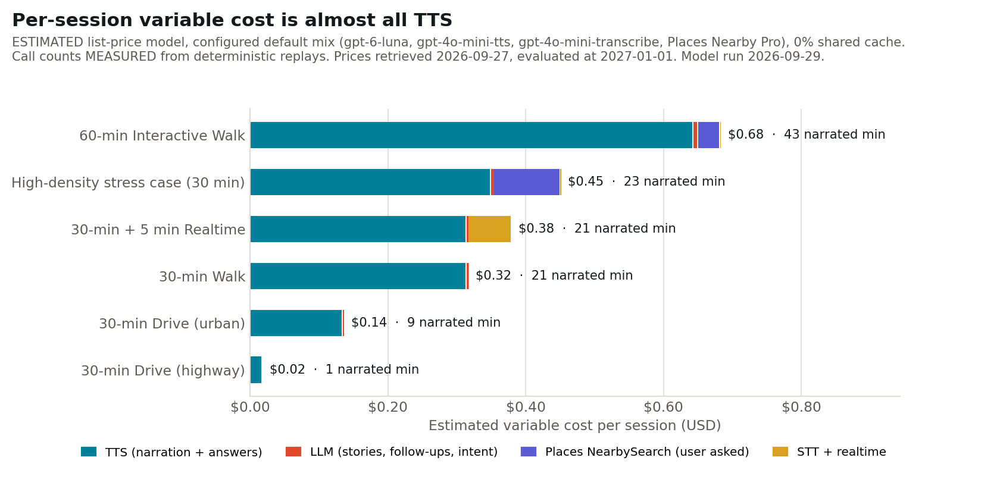
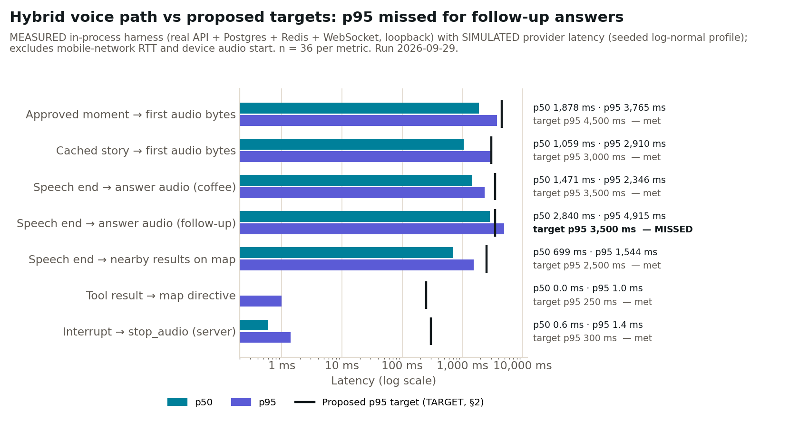
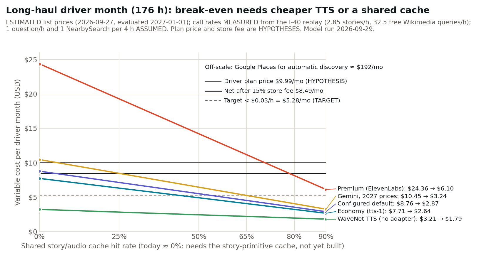
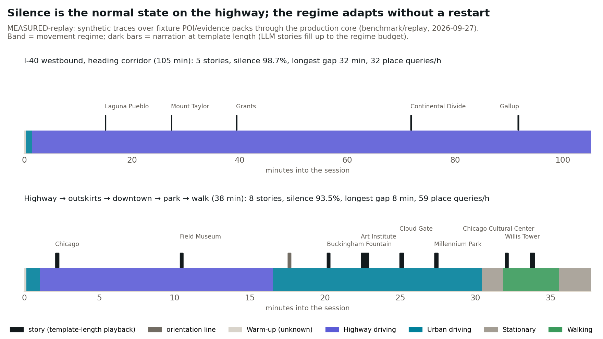
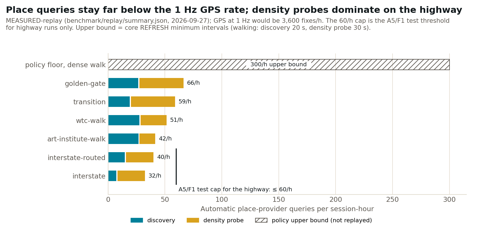

# Performance & Cost Report

> Follows `docs/PERFORMANCE_COST_TEMPLATE.md` section by section. Every value is labelled:
>
> - **MEASURED-tests**: an automated test that ran in this build (vitest / Playwright). Deterministic fakes stand in wherever a provider is involved.
> - **MEASURED-replay**: a deterministic replay of synthetic GPS traces over fixture POI/evidence packs, run through the production core (`@city/replay`).
> - **MEASURED-harness**: the real API in-process (Fastify + Postgres 16 + Redis 7 + WebSocket) on loopback. Every provider is a fake with **SIMULATED provider latency**.
> - **ESTIMATED**: a list-price model (`packages/providers/src/pricing.ts`, retrieved 2026-09-27).
> - **TARGET**: a budget proposed by the implementation team.
> - **NOT YET MEASURED / NOT RUN**: needs credentials, devices, field runs or human raters, none of which were available here.
>
> Nothing in this report is a production measurement or an invoice. No provider keys were supplied, and Wikipedia, Wikidata and Google are unreachable from the build sandbox.
>
> Reproduce with `pnpm bench:acceptance` (about 8 min: suites, replay, harness and web e2e), `pnpm bench:cost` (seconds) and `pnpm bench:charts`.

## 0. Report Metadata

| Field | Value |
|---|---|
| Product / working brand | Telvey (Guides: Ida, Emil) |
| Repository | `city-ai-greenfield-claude`, branch `build/mvp` |
| Build / commit SHA | `53bd624` plus the uncommitted benchmark scripts and this report (`results.json` records `53bd624+uncommitted`) |
| Report date | 2026-09-28 |
| Prepared by | QA / Performance / Cost agent (implementation team) |
| Mobile versions tested | iOS: **NOT RUN** (no Apple account, D-016). Android: **NOT RUN** (no EAS token or SDK). JS bundles and `expo prebuild` verified (docs/MOBILE.md §3); mobile logic tests: 15/15 MEASURED-tests |
| WebApp version tested | `apps/web` production build (Next.js 15) in offline demo mode, Chromium via Playwright: smoke suite 5/5 (MEASURED-e2e). The 5-test screenshot spec is not run by the bench because it rewrites committed screenshots |
| Backend environment | local (sandbox): Node 22.22, Postgres 16, Redis 7 on one Linux host; API in-process |
| Regions tested | Test geographies only, all replays: NYC (WTC), Chicago (Art Institute, highway to downtown), San Francisco (Golden Gate), I-40 in New Mexico. No live region |
| Network profiles tested | loopback only. Wi-Fi / 5G / LTE / degraded: **NOT YET MEASURED**. Network loss is simulated in E3 tests (socket drop, REST during outage, resume) |

## 1. Executive Summary

- **Responsiveness (simulated providers).** The hybrid voice path meets the proposed p95 budgets for story start, the coffee/nearby answer and map updates. It **misses the p95 for contextual follow-ups: 4.9 s against a 3.5 s target**. These are MEASURED-harness numbers under SIMULATED provider latency. Real provider latency is **NOT YET MEASURED**.
- **Largest latency bottleneck.** Provider time dominates. On a follow-up this is STT, then a full non-streamed LLM answer, then full-file TTS of that answer, in series. Our own server overhead is small: frame ingest is ~0.1 ms and the loopback `stop_audio` round trip is 0.6 ms.
- **Largest variable-cost driver: TTS, at 95–99% of every walking or driving session** (ESTIMATED). The configured default (`gpt-4o-mini-tts`) costs about $0.015 per narrated minute. The LLM is under 2% of cost. Automatic discovery is $0 because it runs on Wikimedia.
- **Defaults.** gpt-6-luna for stories and intent, gpt-4o-mini-tts, gpt-4o-mini-transcribe, Wikimedia for discovery and evidence, and Google Places Nearby Search Pro only for questions the user asks explicitly. These are provisional, and the D-010 benchmark (`pnpm bench:providers`) decides them once keys arrive.
- **Strongest cost controls** (all MEASURED-tests):
  - A discovery refresh throttle (32–66 place queries per hour against 3,600 GPS fixes per hour).
  - Wikimedia-first discovery.
  - A 15-minute shared place cache and a 7-day evidence cache.
  - ProviderGuard: budget, then breaker, then timeout, then at most one retry.
  - Reduced mode when Redis is down.
  - Every failure test shows bounded calls (§13).
- **ESTIMATED session costs** (default mix, 0% shared cache): 30-min walk **$0.32**, 30-min urban drive **$0.14**, 30-min highway drive **$0.019**, 60-min interactive walk **$0.68**, 30 min plus 5 min realtime **$0.36–0.51**.
- **Long-haul driver month** (176 h, ESTIMATED): **$8.76 on the default mix, against $8.49 net from a $9.99 driver plan (HYPOTHESIS).** That is break-even on variable cost alone and above the $0.03/h target ($0.050/h).
  - It reaches the target only with a ≥ 65% shared story cache (not built) or with WaveNet-class TTS ($3.21/mo, no adapter yet).
  - Using Google Places for automatic discovery would cost **$192/mo**.
- **Unit economics (HYPOTHESES).** A paying Explorer user has a positive variable margin, about 38%. **Free users are not fundable at 2.1% conversion:** revenue covers 0.2 sessions per MAU per month. Tight free caps and cheaper TTS are prerequisites for launch.
- **Main scaling risk.** Wikimedia rate limits, not money. A session makes 84–175 Wikipedia/Wikidata HTTP requests per hour, against 5,000 requests per hour per IP even with a token. That allows roughly 30–55 concurrent sessions per egress IP before cache sharing.
- **What is real and what is estimated.**
  - Real: test results, replay call counts and server-side overhead.
  - Simulated: every provider latency.
  - Estimated: every dollar figure. Nothing is a bill.
  - Not run: everything involving a device, a field run or the realtime D-section.
- **Top three open optimizations:**
  1. A story-primitive cache (prose and audio shared across users, with the spatial cue synthesized separately).
  2. A cheaper TTS adapter (Google Cloud WaveNet/Standard at $4 per 1M characters is about 4× cheaper) and streamed or segmented answer TTS for follow-ups.
  3. Fewer highway density probes (44 of 57 queries on the I-40 run) and a self-hosted Wikidata/OSM extract.

## 2. Performance Objectives

The owner's template contains **no numeric targets** (D-017). Every value below is a **TARGET proposed by the implementation team** and needs owner sign-off. "Hard failure" is the point at which the UX treats the interaction as failed: fallback, error phrase or skip.

| Interaction | Target p50 | Target p95 | Hard failure / UX threshold | Rationale |
|---|---:|---:|---:|---|
| App launch → usable Explore shell | 1.5 s | 3.0 s | 5 s | Cold start on a mid-range Android. Android vitals treats a cold start ≥ 5 s as excessive. The shell must render before location or API are ready (offline demo fallback exists). |
| Map interaction / camera response | 16 ms/frame | 33 ms/frame | 100 ms input delay | 60 fps pan and zoom. Above 100 ms, input feels laggy. |
| Approved moment → first audible speech | 2.5 s | 4.5 s | 8 s (story skipped if its lead time is gone) | Stories are decided ahead of the place (`minLeadS` 20 s walking, 60 s highway; `LEAD_MARGIN_S` 10 s), so a few seconds are absorbed by lead time. TTS timeout is 9 s and story LLM timeout is 9 s. |
| Cached story → first audio | 1.5 s | 3.0 s | 6 s | Today "cached" means the audio is cached; the LLM still runs (§11). With a story-primitive cache this should fall below 500 ms. |
| User begins interruption → old audio stopped | 150 ms | 300 ms | 500 ms | Local stop in the app (the client stops first, then tells the server). Responses slower than ~200 ms are perceived as unresponsive. |
| End of simple utterance → first response audio | 2.0 s | 3.5 s | 6 s (then a "one moment" phrase) | Hybrid STT → intent → tool/LLM → TTS loop (D-010). Realtime providers are expected to beat this, which is part of the D-010 decision. |
| Nearby-search request → usable result | 1.5 s | 2.5 s | 4 s (router `nearby` timeout) | Speech end to results on the map. The spoken answer follows. |
| Tool action → map update | 100 ms | 250 ms | 1 s | Server-side map directive after validation, before TTS. |
| Realtime session connect → ready | 1.0 s | 2.0 s | 8 s (router `realtime` timeout) | Token issuance plus WebRTC/WS handshake. |
| Realtime reconnect | 1.5 s | 3.0 s | 10 s | Clean reopen after an idle close (D-B6). |
| Admin dashboard initial useful paint | 1.5 s | 3.0 s | 6 s | Internal tool on desktop broadband. |

**Cost targets** (also implementation-team proposals, used in §17):
- 30-min walk ≤ $0.15. At six sessions a month, this keeps a $39.99/yr payer at ≥ 65% variable margin.
- 30-min urban drive ≤ $0.10.
- Highway < $0.03 per active hour (MARKET.md §2).
- Realtime ≤ $0.02 per active minute.

**Inherited vs revised.** Nothing is inherited, because the specification has no numbers. The only inherited quantitative requirements are qualitative ones from ACCEPTANCE_BENCHMARK (for example "no paid request loop at GPS frequency"), and the tests turn those into numbers: ≤ 60 queries/h on the highway and ≥ 20 frames per query.

## 3. Test Methodology

- **Devices and OS versions.** None. No native build exists (D-016). Mobile logic runs in vitest on Node 22.
- **Browsers.** Chromium from Playwright 1.56 (`/opt/pw-browsers`), desktop 1280×800 plus a 390 px viewport check, against a `next build` production build in offline demo mode.
- **Server.** A single Linux sandbox host (see `benchmark/acceptance/results.json → environment` for the CPU count). Postgres 16 and Redis 7 are local. The API runs in the same Node process as the harness client.
- **Provider regions.** Not applicable: no live providers.
- **Network.** Loopback only. RTT and degraded profiles are **NOT YET MEASURED**. E3 simulates loss by closing the socket and sending REST calls during the outage.
- **Cold vs warm.** One warm-up session is excluded before measuring; it primes JIT, DB pools and caches.
  - "Uncached narration" means the narration audio directory is emptied before each session, while evidence and discovery caches stay warm (production TTLs are 7 days and 15 minutes).
  - "Cached story" means the segment audio already exists.
- **Sample count.** 36 measured sessions per metric (`--samples`, minimum 30), plus 36 cached-story sessions. The follow-up and nearby metrics have 36 each, pooled to 72.
- **p50 / p95.** Linear interpolation between closest ranks (Hyndman–Fan type 7, the numpy default).
- **Clocks.**
  - Server intervals come from API telemetry (`telemetry.latency`, `Date.now()` / `performance.now()`).
  - Client intervals come from WebSocket message-arrival time with `performance.now()` in the same process, so there is no clock skew.
- **Audio start.** Defined as "first audio bytes available to the client": the play or say directive has been received and a GET of the segment file has completed. Device decode and playback start are **excluded**.
- **Barge-in.** Measured as client `control interrupt` → `stop_audio` directive received.
  - The apps stop locally before this round trip, so press → silence on a device is **NOT YET MEASURED**.
  - `packages/client/src/bargein.ts` records it on devices.
- **End of speech.** Defined as the start of the `POST /v1/stt` upload of the push-to-talk clip. It therefore includes STT, intent, the tool or LLM call, TTS and the audio fetch.
- **Synthetic vs live.** Replay and harness use fixture places and evidence and fake LLM/TTS/STT/Nearby providers. The harness wraps each fake in a seeded log-normal delay (`LATENCY_PROFILE` in `scripts/bench/acceptance.ts`):

| Simulated provider class | p50 | p95 | Represents |
|---|---:|---:|---|
| LLM story | 1,100 ms | 2,600 ms | small hosted LLM, ~0.9k input / ~200 output tokens, non-streamed |
| LLM follow-up | 700 ms | 1,600 ms | ~100 output tokens |
| LLM intent | 450 ms | 1,000 ms | JSON, ~30 tokens (only when rules miss) |
| TTS | 250 ms + 2.5 ms/char | ×2.4 | hosted TTS returning a complete file |
| STT | 450 ms | 1,100 ms | ~3 s clip, batch |
| Nearby (Places) | 250 ms | 650 ms | Nearby Search Pro, narrow field mask |
| Wikimedia discovery | 500 ms | 1,500 ms | geosearch + SPARQL |
| Wikimedia evidence | 400 ms | 1,200 ms | REST summary + SPARQL |

These figures are **implementation-team assumptions** chosen to be representative of those API classes. They are **not measurements** of any provider. `pnpm bench:providers` replaces them when keys arrive.

### 3.1 Measurement integrity

- The dominant latency terms are simulated. The harness proves the orchestration: serial vs parallel steps, stale-turn dropping, and no hidden waits. It does not prove real provider speed, tail behaviour, cold starts or rate limiting.
- **Fake prose is template-length.** A real LLM fills its word budget, which lengthens TTS latency and cost. The cost model corrects for this (`llmFillOfMaxWords` 0.85). The harness TTS delay grows per character but uses the fake's shorter text, so the TTS terms are **optimistic**.
- **Loopback hides network cost.** Add about 2 × RTT per round trip (LTE is typically 40–120 ms).
- **The WTC walk is a single dense-urban trace,** so every harness session starts the same first story.
- **Replays are synthetic traces over hand-curated fixture packs,** not the Wikipedia candidate density of a real downtown. Real candidate counts will be larger. Ranking was tested for order-independence (A1 reversed-order test), but not for scale.
- **The cost model's usage patterns are assumptions:** questions per hour, session mix, sessions per user and conversion.

## 4. Measured Client Performance

### 4.1 Native iOS

No iOS build exists: Apple Developer credentials are missing (D-016). Every row is **NOT RUN**.

| Metric | Cold/Warm | Sample size | p50 | p95 | Target | Result | Evidence reference |
|---|---|---:|---:|---:|---:|---|---|
| App launch → usable Explore | cold | 0 | – | – | 1.5 s / 3.0 s | NOT RUN | D-016, docs/MOBILE.md §6 |
| Map ready | cold | 0 | – | – | 2.0 s / 4.0 s | NOT RUN | – |
| Explore interaction responsiveness | warm | 0 | – | – | 16 / 33 ms per frame | NOT RUN | – |
| Audio playback start | warm | 0 | – | – | ≤ 300 ms after bytes | NOT RUN | – |
| Background/foreground recovery | – | 0 | – | – | resume ≤ 2 s | NOT RUN (logic only: mobile `FixBuffer`, client `FrameBatcher` tests) | docs/MOBILE.md §2 |
| Memory footprint | – | 0 | – | – | < 250 MB | NOT RUN | – |
| Battery impact during 30 min Explore | – | 0 | – | – | < 8% per 30 min | NOT RUN | – |

### 4.2 Native Android

Same table and status: **NOT RUN**. No EAS token and no Android SDK in the sandbox; the JS bundle (Hermes, 4.3 MB) and `prebuild` pass.
- Expected platform differences to measure: foreground-service survival on OEM battery optimisers (Samsung, Xiaomi) and audio-focus ducking.
- The checklist is in docs/MOBILE.md §4.

### 4.3 WebApp/PWA

| Metric | Browser/device | Sample size | p50 | p95 | Target | Result | Evidence reference |
|---|---|---:|---:|---:|---:|---|---|
| First useful paint | Chromium 1280×800 | 0 | – | – | 1.5 s / 3.0 s | NOT YET MEASURED (functional e2e only) | `apps/web/e2e/smoke.spec.ts` |
| Explore shell ready | Chromium | 0 | – | – | 2.0 s / 3.5 s | NOT YET MEASURED | – |
| Map ready | Chromium | 0 | – | – | 2.5 s / 4.5 s | NOT YET MEASURED | – |
| Story start | Chromium, offline demo, 20× replay speed | 1 functional run | – | – | – | Functional PASS (story shown within the 30 s test timeout) | e2e "tells the 9/11 Memorial story" |

The Playwright smoke suite (5 tests) passed in this run: `results.json → web`. It checks behaviour, not timings. Adding `performance.getEntriesByType('paint')` capture to the e2e is a small follow-up.

## 5. Backend & API Performance

These are MEASURED-harness numbers, loopback, n = 36 sessions, with SIMULATED provider latency where a provider is called. The source is `benchmark/acceptance/latency.json`.

| Service / endpoint | Scenario | Sample size | p50 | p95 | Error rate | Cache status | Result |
|---|---|---:|---:|---:|---:|---|---|
| Context ingestion (`ingestFrame` per frame) | WTC walk frames until first story | 648 | 0.1 ms | 0.1 ms | 0 | – | Deterministic, local. Negligible |
| Discovery | Density probe + discovery per tick | – | sim 500 ms | sim 1,500 ms | 0 | Warm (15-min shared cache) after the warm-up session | Paid only when throttle + cache miss (≤ 66/h in replays) |
| Evidence retrieval | Per decided target | – | sim 400 ms | sim 1,200 ms | 0 | Warm (7-day cache) | Free (Wikimedia); cached per place + language |
| Narrative planning (brief, grounding, segments) | Per story | – | not instrumented separately | – | 0 | – | Deterministic, local; included in the trigger → play interval below |
| Narrative generation + TTS seg 0 → `play` | `trigger_to_first_audio` (server) | 36 | 1,875 ms | 3,763 ms | 0 | Audio cold | Provider-bound (sim) |
| TTS audio serving | GET `/v1/audio/<seg0>` | 36 | 2.1 ms | 3.4 ms | 0 | Local volume | Local |
| Nearby Search | provider call → zod-validated (`nearby_to_result`) | 36 | 208 ms | 604 ms | 0 (invalid rows dropped 36/36) | Not cached (Places terms) | Paid, ~$0.032/call (ESTIMATED) |
| Utterance → first answer audio (server) | `speech_end_to_first_audio`, excl. STT + fetch | 36 | 976 ms | 1,523 ms | 0 | – | Provider-bound (sim) |
| Admin metrics | `/v1/admin/metrics/*` | 0 | – | – | – | – | NOT YET MEASURED (functional tests only: admin.test.ts 8/8) |

**Deterministic and local:** frame ingest, regime and density, scoring, director, brief, grounding, segmentation, resume and safety policies, tool policy, directive sequencing and audio serving.

**Dependent on paid external providers:** LLM (story, follow-up, intent fallback), TTS, server STT, Places Nearby Search, and realtime.

Wikimedia discovery and evidence are free but rate-limited (§14).

## 6. Voice & Realtime Performance

**No provider was benchmarked.** No OpenAI or Gemini key was supplied. The last provider run (`benchmark/providers/2026-09-28T02-42-01-826Z.json`) reports `keysPresent: all false`, so every story, TTS, STT and realtime run was skipped.

| Metric | OpenAI gpt-realtime-2.1-mini | Google gemini-3.8-live | Hybrid (STT → LLM → TTS), default mix |
|---:|---:|---:|---:|
| Connect p50 / p95 | NOT RUN — credentials not supplied | NOT RUN — credentials not supplied | n/a (no session) |
| Speech-end → final recognized turn p50 / p95 | NOT RUN — credentials not supplied | NOT RUN — credentials not supplied | NOT RUN (harness STT sim 450 / 1,100 ms) |
| Speech-end → first response audio p50 / p95 | NOT RUN — credentials not supplied | NOT RUN — credentials not supplied | harness (sim): coffee 1,471 / 2,346 ms; follow-up 2,840 / 4,915 ms |
| Barge-in → output stopped p50 / p95 | NOT RUN — credentials not supplied | NOT RUN — credentials not supplied | server round trip 0.6 / 1.4 ms (loopback); device NOT YET MEASURED |
| Tool-call success rate | NOT RUN — credentials not supplied | NOT RUN — credentials not supplied | fakes: 36/36 validated results, invalid rows dropped |
| False-start rate under road noise | NOT RUN — credentials + noise fixture | NOT RUN | NOT RUN |
| Missed-turn rate under road noise | NOT RUN | NOT RUN | NOT RUN |
| English quality (1–5 rubric) | NOT RUN — human rubric | NOT RUN | NOT RUN |
| Russian quality (1–5 rubric) | NOT RUN — human rubric | NOT RUN | NOT RUN |
| Reconnect success rate | NOT RUN — credentials not supplied | NOT RUN | WS resume: E3 test PASS (exactly-once) |
| Client integration complexity | WebRTC/WS token issuer implemented (`OpenAIRealtimeTokenIssuer`) | Ephemeral token issuer implemented (`GeminiLiveTokenIssuer`) | implemented end to end |
| Realtime cost per active minute (ESTIMATED) | $0.0117 | $0.0087 | ≈ $0.001–0.015 (dominated by answer TTS) |

The realtime cost row assumes 30% user and 40% assistant audio per active minute, with OpenAI history re-billing counted as cached input. `gpt-realtime-2.1` (full) is $0.037 per active minute.

### 6.1 Provider decision

- **Selected default:** none yet. D-010 stays **Provisional**. The hybrid loop is the running default because it works without realtime credentials. Its interim components are the configured defaults: gpt-6-luna, gpt-4o-mini-tts, gpt-4o-mini-transcribe, and Places Nearby Pro for tools.
- **Fallbacks (configured):**
  - Story and intent: OpenAI, then Gemini, then Anthropic.
  - TTS and STT: OpenAI, then Gemini.
  - Realtime: OpenAI, then Gemini.
  - Every provider has a template (story) and device-voice (TTS) floor.
- **Rejected alternatives:**
  - Always-on realtime: cost grows with open-session time, and the risk and complexity of an open microphone while driving (D-010).
  - GPT-Live-1 at $0.05 per session-minute: billed during silence.
  - Google Places for automatic discovery: $0.53–1.54 per 30-min session, $192 per driver-month (ESTIMATED), and Places content cannot be pooled across users.
- **Evidence for the decision:** none measured. Only list-price estimates exist (§7, §9).
- **The decision process that runs when keys arrive:**
  1. Put keys in the environment. They are never written to the repo; see `API-Credentials.example.md`.
  2. Run `pnpm bench:providers`. It verifies model IDs against each provider's list endpoint (OpenAI docs disagreed on model names), then measures story latency, tokens, cost and grounding pass rate on the fixed brief corpus (both Guides, EN and RU), TTS time-to-first-byte and $/min, STT latency, and realtime token issuance.
  3. Run the D-section scripts (D-B1…B6) on each realtime candidate using the same utterances as C1–C3 and a recorded road-noise fixture. Two raters score the EN/RU 1–5 rubric.
  4. Choose by: (a) grounding pass rate ≥ 95% after one retry; (b) meeting the §2 p95 targets; (c) lowest $/narrated minute among those that pass (a) and (b); (d) persona distinctness ≥ 3.5/5. Record the result in D-010, with the losing providers kept as fallbacks.
- **Re-evaluation triggers:**
  - A price change of ±25% (the Gemini promo ends 2027-01-01).
  - Grounding pass rate below 90% over 7 days.
  - p95 regressing past a hard threshold.
  - A new TTS SKU below $0.005/min.
  - Russian quality below 3/5.

## 7. Cost Model Inputs

Pricing is taken from `benchmark/research/provider_pricing.json` (retrieved 2026-09-27) through `packages/providers/src/pricing.ts`. Promotional Gemini prices are **evaluated at 2027-01-01** (after the promo).

| Provider | Service | Pricing unit | Unit price | Source/date | Notes |
|---|---|---|---:|---|---|
| OpenAI | gpt-6-luna (story, intent) | 1M tokens in / out | $0.10 / $0.50 | developers.openai.com, 2026-09-27 | configured default LLM |
| Anthropic | Claude Sonnet 5 (premium prose) | 1M tokens in / out | $2.00 / $10.00 | platform.claude.com, 2026-09-27 | premium mix |
| Google | gemini-3.1-flash-lite | 1M tokens in / out | $0.25 / $1.50 | ai.google.dev, 2026-09-27 | Gemini mix |
| OpenAI | gpt-4o-mini-tts | 1M text tok in / audio tok out | $0.60 / $12 (≈20.8 audio tok/s) | model page, 2026-09-27 | configured default TTS, ≈ $0.015/min |
| OpenAI | tts-1 | 1M characters | $15 | model page, 2026-09-27 | economy TTS, ≈ $0.0135/min |
| Google | gemini-3.8-flash-lite-tts | 1M text / audio tokens (25 tok/s) | $1.00 / $12 (2027) | ai.google.dev, 2026-09-27 | promo halves this until 2027-01-01 |
| ElevenLabs | Flash/Turbo TTS | 1K characters | $0.05 | elevenlabs.io/pricing/api, 2026-09-27 | premium voice, ≈ $0.045/min |
| Google Cloud | TTS Standard / WaveNet | 1M characters | $4 | cloud.google.com, 2026-09-27 | **no adapter**: sensitivity only |
| OpenAI | gpt-4o-mini-transcribe | minute | $0.003 | pricing page, 2026-09-27 | configured default STT |
| OpenAI | gpt-4o-transcribe | minute | $0.006 | pricing page, 2026-09-27 | premium STT |
| Google | gemini-3.5-transcribe | minute | $0.005 | ai.google.dev, 2026-09-27 | – |
| OpenAI | gpt-realtime-2.1-mini | min user audio / min assistant audio | $0.006 / $0.024 (cached in $0.30/1M) | model page, 2026-09-27 | derived per minute |
| OpenAI | gpt-realtime-2.1 | min in / min out | $0.0192 / $0.0768 | pricing page, 2026-09-27 | derived |
| Google | gemini-3.8-live | min in / min out | $0.005 / $0.018 | ai.google.dev, 2026-09-27 | published per-minute |
| Google Maps | Places Nearby Search Pro | 1,000 requests | $32 (5,000 free/mo ignored) | developers.google.com, 2026-09-27 | NearbySearch tool (and risk variant) |
| Google Maps | Dynamic Maps (web) | 1,000 loads | $7 | same | WebApp only; native Maps SDK free |
| Wikimedia | Wikipedia / Wikidata APIs | request | $0 (500 req/h anon, 5,000 req/h token) | api.wikimedia.org (page marked draft) | rate limit is the constraint |
| (assumption) | VPS egress | GB | $0.01 | not sourced | 64 kbps mp3 audio |

## 8. Variable Cost Taxonomy

| Category | In the current build | Model treatment |
|---|---|---|
| Map SDK / map loads | Native Google Maps SDK (free); web Dynamic Maps | $0 native; +$0.007 per WebApp session (not in totals) |
| Automatic place discovery | Wikimedia geosearch + SPARQL, throttled and cached | $0; call counts from replay; rate-limit risk (§14) |
| Explicit nearby search | Google Places Nearby Search Pro, narrow field mask | $0.032/call |
| Place details / enrichment | Not called (Details adapter exists, unused) | $0 |
| Geocoding | Not used | $0 |
| Routes / distance / ETA | Not used (hand-off to Google/Apple/Waze) | $0 |
| Search / grounding / evidence | Wikipedia REST + Wikidata SPARQL, cached 7 days | $0 |
| LLM text input | Real prompt builders: ~915 tokens per walking story (521 without the JSON payload block, §15) | gpt-6-luna $0.10/1M |
| LLM text output | 0.85 × maxWords × 1.35 tokens per word | $0.50/1M |
| Realtime audio / session duration | Token issuer and usage ledger implemented; minutes reported by client | per-minute in/out, plus OpenAI history re-billing |
| STT | Device STT preferred (Auto); server STT fallback | $0.003/min × 3 s per question |
| TTS | Content-addressed per segment; answers per say | chars × SKU; **dominant line** |
| Media / object storage and egress | Local volume behind the API | ≈ $0.0001 per session |
| Transactional email / OTP | Not configured | $0 |
| Observability | Self-hosted (Postgres telemetry, admin console) | $0 variable |

## 9. Per-Session Cost Scenarios

All figures are **ESTIMATED** (list price, default mix, 0% shared cache). Call counts are MEASURED from replays. The CSV is `benchmark/cost/cost_model.csv` (6 scenarios × 6 mixes × 3 cache rates, plus realtime variants).

| Cost component | 30-min Walk | 30-min Drive (urban) | 30-min Drive (highway) | 60-min Interactive Walk | 30-min + 5 min Realtime | High-density stress case |
|---|---:|---:|---:|---:|---:|---:|
| Maps / map loads | $0 | $0 | $0 | $0 | $0 | $0 |
| Places / discovery (auto) | $0 (22.9 Wikimedia queries) | $0 (43.7) | $0 (16.3) | $0 (45.8) | $0 (22.9) | $0 (150) |
| Places / NearbySearch (asked) | $0 | $0 | $0 | $0.032 | $0 | $0.096 |
| Place details | $0 | $0 | $0 | $0 | $0 | $0 |
| Routes / ETA | $0 | $0 | $0 | $0 | $0 | $0 |
| Evidence/search | $0 | $0 | $0 | $0 | $0 | $0 |
| LLM generation | $0.0033 | $0.0020 | $0.0003 | $0.0070 | $0.0033 | $0.0043 |
| TTS | $0.3140 | $0.1348 | $0.0183 | $0.6435 | $0.3140 | $0.3499 |
| Realtime/STT | $0.0002 | $0 | $0 | $0.0008 | $0.0626 (gpt-realtime-2.1-mini) | $0.0014 |
| Storage/egress | $0.0001 | $0.00004 | $0.00001 | $0.0002 | $0.0001 | $0.0001 |
| Other | $0 | $0 | $0 | $0 | $0 | $0 |
| **Total variable cost** | **$0.318** | **$0.137** | **$0.019** | **$0.683** | **$0.380** (Gemini Live $0.361; gpt-realtime-2.1 $0.507) | **$0.452** |
| Narrated minutes | 20.8 | 8.9 | 1.2 | 42.6 | 20.8 (+5 realtime) | 23.2 |

**Scenario assumptions:**
- **30-min walk.**
  - Dense-urban walking and stationary rates from the WTC and Art Institute replays: 18.6 stories/h and 45.8 place queries/h.
  - Stories are capped at the director cadence with LLM-length prose (21/h).
  - 1 follow-up question, EN, 0 realtime minutes.
- **Urban drive.** The urban-driving slices of the Golden Gate replay (0–565 s) and the transition replay (992–1,826 s): 20.6 stories/h, 87.5 queries/h, no questions.
- **Highway drive.** I-40 replay, 2.85 stories/h, 32.5 queries/h, no questions.
- **60-min interactive walk.** Walking rates plus 4 questions ("Why is that important?", "Tell me more", "What is that building?", "Who built it?"), 2 of which fall through the rules to the LLM intent, plus 1 NearbySearch (coffee, handled by rules).
- **30 min + 5 min realtime.** 30-min walk plus one 5-minute burst: 30% user and 40% assistant audio per active minute, 10 turns.
- **Stress case (policy upper bound, not replayed).**
  - Dense walking with every throttle at its floor: 300 queries/h and 19.7 maximum-length Ida stories/h.
  - 6 questions, all via the LLM, and 3 NearbySearch.
- **Common to all:** LLM prose fills 85% of the word budget, 10% grounding retry rate, 6.0 characters per word (measured from replay prose).

**By mix and shared-cache rate** (total per session: 0% / 50% / 80%):

| Mix | 30-min Walk | 30-min Drive urban | 30-min Drive highway | 60-min Interactive | 30+5 Realtime | Stress |
|---|---|---|---|---|---|---|
| Economy (tts-1, device STT) | 0.273 / 0.139 / 0.059 | 0.114 / 0.057 / 0.023 | 0.016 / 0.008 / 0.003 | 0.592 / 0.324 / 0.164 | 0.336 / 0.202 / 0.122 | 0.401 / 0.269 / 0.190 |
| Configured default | 0.318 / 0.162 / 0.069 | 0.137 / 0.068 / 0.027 | 0.019 / 0.009 / 0.004 | 0.683 / 0.372 / 0.186 | 0.380 / 0.225 / 0.131 | 0.452 / 0.298 / 0.206 |
| Gemini stack (2027 prices) | 0.388 / 0.198 / 0.084 | 0.168 / 0.084 / 0.034 | 0.023 / 0.011 / 0.005 | 0.829 / 0.449 / 0.221 | 0.451 / 0.261 / 0.147 | 0.532 / 0.345 / 0.232 |
| Premium voice (Sonnet 5 + ElevenLabs) | 0.965 / 0.493 / 0.210 | 0.414 / 0.207 / 0.083 | 0.058 / 0.029 / 0.012 | 2.013 / 1.069 / 0.502 | 1.028 / 0.556 / 0.272 | 1.181 / 0.714 / 0.435 |
| WaveNet TTS (**no adapter**, sensitivity) | 0.075 / 0.039 / 0.017 | 0.032 / 0.016 / 0.006 | 0.004 / 0.002 / 0.001 | 0.187 / 0.114 / 0.069 | 0.138 / 0.101 / 0.079 | 0.182 / 0.146 / 0.124 |
| RISK: Places for auto discovery | 1.050 / 0.894 / 0.801 | 1.537 / 1.468 / 1.427 | 0.539 / 0.529 / 0.524 | 2.148 / 1.837 / 1.650 | 1.112 / 0.957 / 0.863 | 5.252 / 5.098 / 5.006 |

**The 50% and 80% cache columns are hypothetical.** With the current code the shared narration hit rate is ≈ 0% (§11).

Two further consequences:
- **Premium voice exceeds the default `usdPerSession` budget of $1.00** in the 60-minute interactive walk. The session would degrade to template or text-only output part-way through.
- **Walking narrates about 69% of the time with LLM-length stories:** 20.8 of 30 minutes. That is a product-policy observation as much as a cost one (§16).

## 10. Unit Economics Scenarios

This is an engineering model. **Every revenue, pricing and usage input is a HYPOTHESIS.** Fixed infrastructure costs are **ASSUMPTIONS**, not sourced. Free-tier caps and Google free quotas are ignored. The CSV is `benchmark/cost/unit_economics.csv`.

| Assumption | Small | Medium | Large |
|---|---:|---:|---:|
| MAU | 1,000 | 25,000 | 250,000 |
| Active sessions/user/month | 2.08 (payers 6, free 2: HYPOTHESIS) | 2.08 | 2.08 |
| Avg session minutes | 34.8 (mix: 45% walk30, 20% urban drive, 15% highway, 15% interactive 60, 5% walk + realtime) | 34.8 | 34.8 |
| Avg variable cost/session | $0.295 (default, 0% cache) · $0.155 (50%) · $0.043 (WaveNet + 50%) | same | same |
| Monthly variable infrastructure cost | $614 · $323 · $90 | $15,346 · $8,081 · $2,241 | $153,462 · $80,814 · $22,414 |
| Fixed infrastructure estimate | $60 (1 VPS, backups, domain) | $450 (2–3 API VPS, managed PG + Redis) | $4,000 (multi-instance, managed data, CDN, self-hosted Wikidata/OSM) |
| Total technical COGS | $674 · $383 · $150 | $15,796 · $8,531 · $2,691 | $157,462 · $84,814 · $26,414 |
| Example subscription / revenue assumption* | 2.1% of MAU pay $39.99/yr, net of 15% store fee = $59/mo | $1,487/mo | $14,871/mo |
| Implied gross margin* | −1,033% · −544% · −152% | −962% · −474% · −81% | −959% · −470% · −78% |

\*These are hypotheses, not validated externally. The 2.1% is RevenueCat's median day-35 freemium conversion (MARKET.md); $39.99/yr is Explorer Annual (MONETIZATION.md §3).

**Reading the table:**
- **A paying user is profitable.** 6 sessions × $0.295 = $1.77/mo against $2.83/mo net revenue, a **38% variable margin** on the default mix at 0% cache.
- **The free tier is not affordable at 2.1% conversion.** Revenue per MAU ($0.06) funds **0.2 default-mix sessions per MAU per month**. Break-even needs **≈ 37% paying users** at 0% cache.
- **What fixes it (all in combination):**
  - Hard free caps well below the "~30 narrated min/day" in MONETIZATION.md, such as one short session per week.
  - WaveNet-class TTS.
  - The story-primitive cache.
  - Trip passes, which this model ignores.

## 11. Cache Strategy & Measured Effect

| Cache layer | Key / scope | TTL/invalidation | Hit rate | Cost avoided | Latency effect | Failure behavior |
|---|---|---|---:|---:|---:|---|
| Discovery | `pl:v1:{geohash cell sized to radius}:{radius bucket}:{floor}:{kinds}:{lang}:{corridor fingerprint}`, shared across users (Wikimedia only; Google results never cached) | 15 min | NOT YET MEASURED in production. Harness: warm after the first session. Replay ≈ n/a | Wikimedia requests (free, rate-limit headroom) | sim 500 / 1,500 ms per miss avoided | Redis down → in-process LRU (20k) + reduced mode: no density probe, ≥ 90 s between discovery fetches, 30/min process-wide (F5: 1 call per 300 frames) |
| Evidence | `ev:v1:{placeId}:{lang}`, shared; negative results cached | 7 days; negative 6 h | NOT YET MEASURED | Wikimedia requests | sim 400 / 1,200 ms per miss avoided | same fallback; transient failures are not cached as thin |
| Story primitives | **Not implemented.** Brief is deterministic per decision but embeds session id, time and spatial cue | – | 0% | – | – | – |
| Final narration (LLM prose) | **Not cached** | – | 0% | – | – | – |
| TTS/media | Content-addressed file: sha256(segment text + voice + locale, provider, model, voice), immutable URL | Never expires (disk) | ≈ 0% cross-user for LLM prose; high for fixed phrases and templates. Harness "cached story" path: 36/36 hits when prose repeats | TTS characters | 1,878 → 1,059 ms p50 (sim); still runs the LLM | Fallback-provider audio held in memory 1 h and never stored under the planned key; synthesis failure → text + device TTS (F4) |
| Routes/ETA | Not used | – | – | – | – | – |

**Why final prose is not cached, and how leakage is prevented.** Story prose is contextual. It contains a spatial cue with the current distance and direction, optional callbacks to places this user passed, and a Guide persona. It is regenerated per session at temperature 0.7, so byte-identical reuse is rare and the TTS cache hits almost only on fixed phrases.

Nothing user-specific is used as a cache key, and caches are keyed by place, language and geometry cell. **One caveat:** the audio of a story that contains journey callbacks names places this user passed earlier. Its URL is public but unguessable (40 hex characters of sha256) and immutable. Treat that as low risk; it is documented, not mitigated.

**The biggest open cost lever** is a story-primitive cache. It would cache the LLM body keyed by (placeId, angle, Guide, locale, mode, fact ids), synthesize the short spatial-cue sentence separately, and serve segments 1..n from the shared audio cache. On repeated interstates and popular landmarks this is the path to the 50–80% columns in §9.

## 12. Provider Call Budgets & Rate Controls

Values are the defaults from `DEFAULT_BUDGET` (`packages/providers/src/resilience.ts`). They can be changed in the admin console and persisted in `provider_budgets`.

| Paid operation | Per-session limit | Time-window limit | Deduplication | Fallback when exhausted |
|---|---:|---:|---|---|
| Automatic discovery | `maps` 240 / `knowledge` 600 calls (Wikimedia counts as knowledge); refresh throttle (20–60 s min interval, movement-based, empty-result backoff ×2 up to ×8) | 600/min `maps`, 1,200/min `knowledge` process-wide | 15-min shared place cache; per-session candidate reuse between refreshes | no new candidates → silence (director); reduced mode when cache is down |
| Place details | not called | – | – | – |
| Evidence/search | `knowledge` 600 | 1,200/min | 7-day cache + per-session pack map | place treated as unavailable (no story; not permanently thin) |
| LLM generations | `llm` 200 (≤ 2 per story: one constrained retry) | 600/min | intent rules before LLM; retried `utteranceId` never re-runs | deterministic template (story) / deterministic answer (follow-up) / heuristic intent |
| TTS | `tts` 600 | 1,200/min | in-flight de-dup by audio key; content-addressed store | text in directive → device TTS (F4) |
| Realtime active minutes | `realtime` 6 tokens, **900 s** per session, token `maxSeconds` 300, idle close 20 s | 60 tokens/min | – | 429 `realtime_budget_exhausted` → hybrid loop |
| All categories | **$1.00 estimated per session** (from the price table) | – | – | budget refusal stops the fallback chain (no fan-out) |
| NearbySearch (tool) | ToolPolicy 3 per 60 s | REST route 30/min/IP | `utteranceId` de-dup | spoken "limited" phrase |

**Two observations:**
1. **Realtime seconds are reserved, never reconciled.** Each token reserves its full `maxSeconds` (300 s) against the 900 s session cap, and `/v1/realtime/usage` does not credit unused seconds back. A session therefore gets at most three realtime bursts even if each lasted 20 s. This is cost-safe but hurts UX (§16).
2. **Per-session caps assume sessions of normal length.** An 8-hour trucker session uses about 23 stories and 8 questions, which is well inside the caps. Configuring Google Places for discovery would exhaust the 240 `maps` calls in about 7 hours.

## 13. Failure-Loop Cost Tests

The evidence is `apps/api/test/resilience.test.ts` (REST frames at 1 Hz over the WTC trace; real Postgres, and Redis unless stated) plus `packages/providers/test/resilience.test.ts`. The call counts are the ones these tests printed in this run.

| Failure condition | Expected bounded behavior | Calls observed | Cost risk | Result | Evidence |
|---|---|---:|---|---|---|
| Empty discovery result | no paid refresh per GPS update; exponential backoff | 4 place calls / 300 frames (API); ≤ 40 / 3,158 frames on the empty 105-min highway replay | none | PASS | api "F1: empty discovery"; replay "F1 — Empty discovery result" |
| Maps quota exceeded (429) | single attempt, breaker opens with a 10-min hard cooldown | 1 / 300 frames | none | PASS | api "F2: quota exceeded" |
| Provider timeout | ≤ 1 retry, breaker after 3 failures, 30 s cooldown with a single half-open probe | 3 attempts / 300 frames (test bound ≤ 6) | low | PASS | api "F2: place provider timeouts" |
| Invalid credential (401) | single attempt, hard cooldown | 1 / 300 frames | none | PASS | api "invalid credential" |
| Redis/cache unavailable | explicit reduced mode; `/readyz` degraded; no storm | 1 place call / 300 frames; narration continues | none | PASS | api "F5: cache (Redis) unavailable" |
| LLM failure | template story for the same target; ≤ 2 LLM calls per story | ≤ 2 per story (hallucinating LLM); kill switch → 0 | none | PASS | api "F3" ×2 + kill-switch test; providers "never substitutes the target" |
| TTS failure | text delivered, `audioUrl` null, conversation continues | ≤ 4 TTS attempts total (breaker) | none | PASS | api "F4: TTS down" |
| Realtime connect failure | no retry (`noRetry`), breaker, budget | 1 attempt per token request (by construction; no dedicated API test) | low | PARTIAL | router code + providers ProviderGuard tests; no realtime-specific API test |
| Network flap | resume delivers only missed directives; retried utterance does not re-run the tool | 1 NearbySearch despite a retried `utteranceId`; 0 duplicate directives | none | PASS | api "E3: reconnect"; client "SessionChannel (E3 reconnect)" |

**No failure created an unbounded paid retry loop.** No unbounded retry exists in the code: `retryOnce` is hard-capped at one retry.

## 14. Scaling Model

- **State boundaries.** `SessionRuntime` is hot in one API process, and a WebSocket is pinned to that instance. After every event a snapshot goes to Redis (24 h TTL), so a restart or a reconnect to another instance resumes exactly (E3). Journey memory is saved to Postgres periodically.
  - Horizontal scaling needs sticky WS routing, or cross-instance directive fan-out. Today the outbox lives in the owning process; resume via snapshot works, but live fan-out does not.
- **Database.** Telemetry is buffered: flushed every second, 5,000-row buffer per stream, and dropped (with a count) on outage, never blocking. Postgres sees batched inserts of costs, events, latency samples and stories. It is not a hot-path dependency: sessions run in Redis and memory.
  - Load at scale is **NOT YET MEASURED**. Estimate: a few rows per session-minute.
- **Redis.** Hot session snapshots, rate limits, and place/evidence caches. Loss of Redis puts the process in reduced mode (F5).
- **Queue / background work.** None. TTS for segments 1..n is pipelined in-process after `play`.
- **WebSocket limits.** One socket per active session; Fastify/ws limits are **NOT YET MEASURED**. CPU per frame is small: context ingest is about 0.1 ms p95 over 648 frames (MEASURED-harness). Scoring is not instrumented separately.
- **Provider quotas.** **The binding constraint is the Wikimedia rate limit.** Per session-hour the replays make:

  | Mode | Wikipedia/Wikidata HTTP requests per hour |
  |---|---:|
  | Walking | 92 |
  | Highway (route corridor) | 84–97 |
  | Urban driving | 175 |

  Wikimedia allows 5,000 req/h per IP with a token and 500 without. One egress IP with a token therefore supports only **≈ 30–55 concurrent sessions** before cache sharing, or ≈ 3–5 anonymous. The page for these limits is marked draft and the SPARQL limits could not be fetched.
  - Migration trigger: more than ~20 concurrent sessions sustained.
  - Response: a self-hosted Wikidata/OSM extract or a Wikimedia Enterprise agreement, and pre-warming of popular corridors.
  - Paid-provider quotas (OpenAI, Google) are **NOT YET MEASURED**.
- **Process-local budget windows.** `ProviderBudget` per-minute windows are per process, so N instances allow N× the global cap. Moving the windows to Redis is required before going multi-instance.
- **Media storage and egress.** Audio is on a local volume. Multi-instance needs shared object storage behind a CDN: files are immutable and content-addressed, which suits a CDN. About 10 MB of mp3 per 30-min walk at 64 kbps.
- **Single-VPS MVP limits.** One process, one Redis, one Postgres, local audio. Expected ceiling: the Wikimedia limit (tens of concurrent sessions), well before CPU.
- **Migration triggers:**
  - > 20 concurrent sessions: Wikidata extract and Redis-backed budget windows.
  - > 1 instance: sticky WS routing, object storage, CDN.
  - > 1k DAU: managed Postgres and Redis, provider-quota review.

## 15. Optimization Decisions

| Decision | Benefit | Cost / downside | Evidence | Status |
|---|---|---|---|---|
| Wikimedia-first discovery; Places only for explicit questions | Automatic discovery $0 instead of $0.53–1.54 per 30 min ($192 per driver-month) | Rate limits; no business data (hours, ratings) in discovery | cost_model `places_discovery` mix | accepted |
| Discovery refresh throttle + empty backoff | 32–66 queries/h vs 3,600 GPS fixes/h | Staler candidates between refreshes (re-scored locally) | replay + F1 tests | accepted |
| Content-addressed segment audio | Cheap re-play and resume; CDN-friendly | Almost no cross-user hits with LLM prose | §11 | accepted |
| Story-primitive cache (shared prose + separate spatial cue) | Up to 50–80% of story LLM + TTS avoided; faster "cached story" start | Less contextual prose; cache-key and privacy design | §9 cache columns (hypothetical) | **deferred, highest priority** |
| Cheaper TTS (Google Cloud Standard/WaveNet $4/1M chars) | ≈ 4× lower session cost (30-min walk $0.32 → $0.075) | Voice quality; needs an adapter and a rubric score | cost_model `wavenet_hypothetical` | deferred (needs adapter + D-010 rubric) |
| Remove the JSON payload block from real-LLM prompts | Walking story input 915 → 521 tokens (−43%); lower TTFT | Fakes read the payload (keep it for fakes only) | cost_model `meanStoryTokensInWithoutJsonPayload` | proposed (small change in `prompts.ts`) |
| Stream / segment answer TTS for follow-ups | Follow-up p95 back under 3.5 s (first sentence plays while the rest synthesizes) | More TTS requests per answer | latency: follow-up p95 4.9 s vs 3.5 s | proposed |
| Fewer highway density probes (derive density from discovery results or 3× the interval) | Highway queries 32.5 → ~12/h; Wikimedia headroom | Slower density-class change detection on exits | replay: 44 of 57 highway queries are density probes | proposed |
| Hybrid voice instead of always-on realtime | Cost bounded to spoken minutes | Slower turn-taking than realtime (unmeasured) | D-010 | accepted (provisional) |
| Per-session USD cap $1.00 | Hard stop on runaway sessions | Premium voice exceeds it in 60 min | §9 | accepted; tune per tier |

## 16. Open Performance / Cost Risks

| Risk | Impact | Likelihood | Detection metric | Mitigation | Owner/status |
|---|---|---|---|---|---|
| Free tier unaffordable at plausible conversion | High | High (model) | cost per MAU vs revenue per MAU (admin cost view) | hard free caps, cheaper TTS, primitive cache, passes | product + eng / open |
| TTS price dominates (95%+ of cost) | High | Certain | $ per narrated minute | WaveNet adapter; rubric in D-010; cache | eng / open |
| Wikimedia rate limits cap concurrency at tens of sessions | High | High at launch | 429s from Wikimedia; `provider_error` events | token, Wikidata/OSM extract, corridor pre-warm | eng / open |
| Real provider latency exceeds simulated profile (follow-up already misses p95 in simulation) | Medium | Medium | `speech_end_to_first_audio` p95 in admin latency | streamed/segmented TTS; smaller answer budgets; D-010 | eng / open |
| Walking narration ~69% of the time with LLM-length stories | Medium (UX + cost) | Medium | narrated minutes per session-hour | revisit walking `maxStoryS` / `minGapS`; count narrated minutes toward the free cap | product / open |
| Driver-plan margin ≈ 0 without cache (highway $0.050/h vs $0.03/h target) | Medium | High | cost per highway hour | primitive cache for corridors; WaveNet; fewer density probes | eng / open |
| Driving stories can exceed the regime's stated hard cap: highway `maxStoryS` 75 s × Ida verbosity 1.15 = 86 s (transition replay shows 86 s budgets) | Medium (E1 safety wording) | Certain for Ida | `durationBudgetS` in story events | clamped: verbosity can only shorten stories while driving (`storyBudget`, regression test `story-cap.test.ts`); transition replay now shows 75 s highway / 60 s urban | core / **fixed** (commit after benchmark run) |
| Realtime budget reserves 300 s per token and never reconciles (max 3 bursts per session) | Low (UX) | Certain | `realtime_budget_exhausted` 429s | credit unused seconds on `/v1/realtime/usage` | api / open |
| Repeat routes re-tell the same stories (memory is per session; new sessions start empty) | Medium for truckers | High on commutes | repeated place ids per user | seed session memory from recent `journey_memory` | api / open |
| Process-local budget windows under multi-instance | Medium | When scaling | provider spend per minute | Redis-backed windows | eng / open |
| Gemini promo ends 2027-01-01 (prices double) | Low–Medium | Certain | price table date | model already priced at 2027 | eng / accounted |
| Premium mix trips the $1 session cap mid-session | Low | If premium enabled | `session_usd` budget refusals | per-tier caps | eng / open |

## 17. Final Scorecard

| Area | Target | Actual / estimate | Status | Notes |
|---|---|---|---|---|
| Native startup | 1.5 s / 3.0 s | NOT RUN (no builds) | NOT RUN | D-016 credentials |
| Trigger -> first audio | 2.5 s / 4.5 s | 1.88 s / 3.77 s (MEASURED-harness, simulated providers) | PARTIAL | inside target in simulation; real providers and device playback not measured |
| Barge-in stop | 150 / 300 ms (device) | server round trip 0.6 / 1.4 ms (loopback); device NOT YET MEASURED | PARTIAL | local stop precedes the round trip; B3 stale-output test passes |
| Simple follow-up latency | 2.0 s / 3.5 s | follow-up 2.84 s / 4.92 s; coffee 1.47 s / 2.35 s (MEASURED-harness, simulated) | FAIL | follow-up misses p50 and p95 even in simulation (serial STT → LLM → full-file TTS) |
| Nearby search latency | 1.5 s / 2.5 s | 0.70 s / 1.54 s speech end → map (simulated) | PARTIAL | inside target in simulation |
| 30-min walking variable cost | ≤ $0.15 | $0.318 (ESTIMATED, default, 0% cache) | FAIL | TTS 99%; $0.075 with WaveNet-class TTS |
| 30-min driving variable cost | ≤ $0.10 urban; < $0.03/h highway | $0.137 urban; $0.019 per 30 min = $0.037/h highway (ESTIMATED) | FAIL | both slightly above target |
| Realtime active-minute cost | ≤ $0.02 | $0.0117 (gpt-realtime-2.1-mini), $0.0087 (gemini-3.8-live), ESTIMATED | PARTIAL | list-price estimate only; realtime NOT RUN |
| Failure-loop containment | zero unbounded loops | 0 unbounded; all 8 failure tests bounded (1–4 calls) | PASS | §13 |
| Provider replaceability | required | Interfaces + ordered fallback chains + fakes; all tests swap providers | PARTIAL | no real provider exercised or swapped live |

**Acceptance summary** (`benchmark/acceptance/results.json`, run 2026-09-28): PASS 13 · PARTIAL 8 · FAIL 0 · NOT RUN 6.

| ID | Status | Evidence (one line) |
|---|---|---|
| A1 | PASS | 9/11 Memorial first story at 361 m; local targets precede distant; reversed provider order gives identical selection (replay) |
| A2 | PASS | Bridge first story at 5.8 km (reach 12.2 km) vs small-POI reach; Vista Point suppressed with reasons |
| A3 | PASS | Art Institute first at 426 m; farther objects never precede; enclosing city is ambient |
| A4 | PASS | Thin evidence → ≤ 1 fact-free orientation line, never a story; 0 grounding failures |
| A5 | PARTIAL | I-40: 5 stories, 0 behind, 98.7% silence, 32.5 queries/h, rejections with reasons; real-road run NOT RUN |
| A6 | PASS | highway→urban→stationary→walking in one session, 0 restarts, no re-tells; drive HUD e2e |
| A7 | PARTIAL | Same code and config in three cities (fixture source); live Wikimedia flow NOT RUN (no egress) |
| B1 | PARTIAL | Follow-up draws unspoken facts from the same pack; LLM non-repetition NOT RUN |
| B2 | PARTIAL | Same lead fact for both Guides in 31/31 packs; persona prose + human rubric NOT RUN |
| B3 | PARTIAL | Callbacks only from structured memory; LLM coherence NOT RUN |
| C1 | PASS | 36/36 harness sessions: stop, preserve, validated map, grounded answer, resume same plan; ≈ $0.035 per coffee turn (ESTIMATED) |
| C2 | PASS | No place or nearby call on follow-up (36/36); grounded against the active brief |
| C3 | PASS | Topic change abandons the story; old plan never replays |
| D-B1…B6 | NOT RUN | Realtime credentials not supplied (hybrid-path B3 analogue passes) |
| E1 | PARTIAL | Drive HUD, stricter cadence, holds on manoeuvre and touch; real vehicle/device NOT RUN |
| E2 | PARTIAL | Background logic unit-tested, OS table documented; devices NOT RUN |
| E3 | PARTIAL | Exactly-once resume, no tool re-run; on-device playback during outage NOT RUN |
| F1–F5 | PASS | Bounded calls in every failure test (§13) |

**Section G metrics** are in `results.json → sectionG`, each with its label:
- Relevance regression: 100% of replay relevance assertions passed.
- Wrong-target rate: 0/33 replay stories.
- Weak-evidence grounding failures: 0.
- Latency percentiles as above.
- Session costs as in §9.
- Cache hit rates by layer: NOT YET MEASURED.

## 18. Evidence Index

- **Raw benchmark JSON/CSV:**
  - `benchmark/acceptance/results.json`: scenario rows A1…F5 + D, per-test evidence, suites, web e2e, harness checks, section G, C1 cost.
  - `benchmark/acceptance/latency.json`: p50/p95, method, simulated latency profile, observed draws.
  - `benchmark/cost/cost_model.json`, `cost_model.csv`, `truck_driver_month.csv`, `unit_economics.csv`.
  - `benchmark/replay/*.json`: replay summaries, stories and timelines.
  - `benchmark/providers/2026-09-28T02-42-01-826Z.json`: provider bench with no keys.
- **Traces / logs:** replay timelines (`benchmark/replay/<scenario>.json → timeline`) with per-decision reasons and rejections. Test console counts are in `results.json → testConsole`. No secrets exist in any artifact.
- **Screenshots:** `deliverables/screenshots/web/*` (drive mode, debug timeline, admin demo views, labelled as demo).
- **Charts** (PNG + SVG), in `deliverables/charts/`:
  - `cost_per_session_by_component`
  - `truck_driver_month_vs_cache`
  - `latency_p50_p95_vs_targets`
  - `replay_timeline_interstate_transition`
  - `query_rate_vs_f1_cap`
- **Profiler captures:** none (NOT YET MEASURED).
- **Provider-pricing references:** `docs/research/PROVIDER_PRICING.md`, `benchmark/research/provider_pricing.json`, `packages/providers/src/pricing.ts`.
- **Scripts that reproduce the calculations:**
  - `scripts/bench/acceptance.ts` (`pnpm bench:acceptance`)
  - `scripts/bench/cost-model.ts` (`pnpm bench:cost`)
  - `scripts/bench/charts.py` (`pnpm bench:charts`)
  - `scripts/bench/providers.ts` (`pnpm bench:providers`)
  - `pnpm replay`
- **Dashboard screenshots:** `deliverables/screenshots/web/admin-*-demo-labelled.png`. These show demo data, not measurements.
- **CI runs:** none yet (D-015 awaiting VPS/GitHub setup). Local `pnpm -r test`: core 173, providers 85, replay 35, client 29, api 72, mobile 15 (all green); web smoke e2e 5/5 in the bench run (10/10 including the screenshot spec, per `apps/web/test-results/.last-run.json` from the web build).

